-   [1 Appendix](#appendix)
    -   [1.1 Enkel linjär regression](#enkel-linjär-regression)
        -   [1.1.1 Mäklare innan
            sammanfogning:](#mäklare-innan-sammanfogning)
        -   [1.1.2 Mäklare efter
            sammanfogning:](#mäklare-efter-sammanfogning)
        -   [1.1.3 Rum:](#rum)
        -   [1.1.4 ByggÅr innan
            sammanfogning:](#byggår-innan-sammanfogning)
        -   [1.1.5 ByggÅr efter
            sammanfogning:](#byggår-efter-sammanfogning)
        -   [1.1.6 Kommun:](#kommun)
        -   [1.1.7 AvståndVattenMeter:](#avståndvattenmeter)
        -   [1.1.8 Hyra:](#hyra)
        -   [1.1.9 BoArea:](#boarea)
        -   [1.1.10 ListPris:](#listpris)
        -   [1.1.11 Våning innan
            sammanfogning:](#våning-innan-sammanfogning)
        -   [1.1.12 Våning efter
            sammanfogning:](#våning-efter-sammanfogning)
        -   [1.1.13 SåldSäsong:](#såldsäsong)
        -   [1.1.14 AreaPerRum:](#areaperrum)
        -   [1.1.15 PrisPerKvm:](#prisperkvm)
        -   [1.1.16 HyraPerKvm:](#hyraperkvm)
    -   [1.2 Modeller:](#modeller)
        -   [1.2.1 Modell 1, innan borttagning av
            outliers:](#modell-1-innan-borttagning-av-outliers)
        -   [1.2.2 Modell 1, efter borttagning av
            outliers:](#modell-1-efter-borttagning-av-outliers)
        -   [1.2.3 Modell 2, log-transformation på
            responsvariabeln:](#modell-2-log-transformation-på-responsvariabeln)
        -   [1.2.4 Modell 3, log-transformation på alla kontinuerliga
            förklarande variabler samt
            responsvariabeln:](#modell-3-log-transformation-på-alla-kontinuerliga-förklarande-variabler-samt-responsvariabeln)
        -   [1.2.5 Modell 4, log-transformation på de omvandlade
            kontinuerliga variablerna (enligt residual på enkel linjär
            modell):](#modell-4-log-transformation-på-de-omvandlade-kontinuerliga-variablerna-enligt-residual-på-enkel-linjär-modell)
        -   [1.2.6 Modell 5, log-transformation enligt scatterplott i
            enkel linjär
            regression:](#modell-5-log-transformation-enligt-scatterplott-i-enkel-linjär-regression)
    -   [1.3 Modeller efter stegvis
        variabelselektion:](#modeller-efter-stegvis-variabelselektion)
        -   [1.3.1 Modell 1 Stepwise:](#modell-1-stepwise)
        -   [1.3.2 Modell 2 Stepwise:](#modell-2-stepwise)
        -   [1.3.3 Modell 3 Stepwise:](#modell-3-stepwise)
        -   [1.3.4 Modell 4 Stepwise:](#modell-4-stepwise)
        -   [1.3.5 Modell 5 Stepwise:](#modell-5-stepwise)
    -   [1.4 Prediktion:](#prediktion)

1 Appendix
==========

1.1 Enkel linjär regression
---------------------------

### 1.1.1 Mäklare innan sammanfogning:

    ## 
    ## Call:
    ## lm(formula = SåldPris ~ Mäklare, data = data_träning)
    ## 
    ## Residuals:
    ##      Min       1Q   Median       3Q      Max 
    ## -3845000  -712051  -262051   411878 13228417 
    ## 
    ## Coefficients:
    ##                                                 Estimate Std. Error t value
    ## (Intercept)                                      3500000    1214651   2.881
    ## MäklareAFI FastighetsMäklare                    -1753333    1402558  -1.250
    ## MäklareAlertus Fastighetsbyrå AB                -1071875    1252034  -0.856
    ## MäklareAlexander White                             12000    1330584   0.009
    ## MäklareAlicia Edelman Fastighetsmäkleri          -634839    1234087  -0.514
    ## MäklareAmbassadör Fastighetsmäkleri              -408333    1402558  -0.291
    ## MäklareAndersson & Asplund Mäklarbyrå Stockholm -1125000    1717776  -0.655
    ## MäklareAsira                                    -1450000    1487638  -0.975
    ## MäklareBerggren Hörle                            4750000    1717776   2.765
    ## MäklareBest of Homes                             -700000    1717776  -0.408
    ## MäklareBjurfors                                  -897289    1215618  -0.738
    ## MäklareBlok                                      -157500    1487638  -0.106
    ## MäklareBlumenthalHoffman Fastighetsmäkleri      -1325000    1717776  -0.771
    ## MäklareBostadsrättsspecialisten                   475000    1717776   0.277
    ## MäklareBOSTHLM                                   -598095    1243235  -0.481
    ## MäklareBototal                                  -1805000    1717776  -1.051
    ## MäklareBremberg Fastighetsmäkleri                -550000    1717776  -0.320
    ## MäklareBrokr Fastighetsmäklare AB                -670000    1311973  -0.511
    ## MäklareBronze Fastighetsförmedling AB            -981750    1244647  -0.789
    ## MäklareBällstaudde Bostadsutveckling AB           -32105    1246206  -0.026
    ## MäklareCredentia AB                              -811667    1402558  -0.579
    ## MäklareDerome Bostad                             1837500    1487638   1.235
    ## MäklareDiplomat Fastighetsmäkleri AB             -725000    1487638  -0.487
    ## MäklareEdward & Partners Fastighetsmäklare AB    1938750    1358021   1.428
    ## MäklareEkenstam Fastighetsmäklare                 833333    1402558   0.594
    ## MäklareEklund Stockholm New York                 1927500    1358021   1.419
    ## MäklareEliases Sthlm                            -1960000    1487638  -1.318
    ## MäklareERA                                       -823288    1219500  -0.675
    ## MäklareErik Olsson Fastighetsförmedling          -572912    1218465  -0.470
    ## MäklareESSTATE AB                                1480000    1717776   0.862
    ## MäklareEstate Fastighetsbyrå AB                  4150000    1717776   2.416
    ## MäklareFabergé Fastighetsmäkleri                  -95000    1402558  -0.068
    ## MäklareFantastic Frank Fastighetsmäkleri        -1418333    1402558  -1.011
    ## MäklareFastighetsbyrån                           -944313    1214983  -0.777
    ## MäklareFastighetsmäklarna                        -163519    1236940  -0.132
    ## MäklareGardefalk & Co                           -1150000    1717776  -0.669
    ## MäklareGrand Fastighetsförmedling                -177500    1288332  -0.138
    ## MäklareGripsholms Fastighetsförmedling           -793333    1402558  -0.566
    ## MäklareHans Mörner Fastighetsförmedling           600000    1717776   0.349
    ## MäklareHemverket                                -1422663    1264249  -1.125
    ## MäklareHilmkil Fastighetsförmedling             -1575000    1487638  -1.059
    ## MäklareHistoriska Hem AB                          -26111    1280355  -0.020
    ## MäklareHusmanHagberg                             -905464    1215541  -0.745
    ## MäklareHägerstens mäklare                        -900000    1717776  -0.524
    ## MäklareHögalidsmäklarna                         -1700000    1717776  -0.990
    ## MäklareIndivida Fastighetsmäkleri               -1005000    1717776  -0.585
    ## MäklareInnerstadsspecialisten AB                  885357    1257283   0.704
    ## MäklareJägholm Norrortsmäklarna                 -1060646    1217148  -0.871
    ## MäklareKarlsson & Uddare                         -546250    1358021  -0.402
    ## MäklareLagerlöfs Fastighetsmäkleri               -801667    1402558  -0.572
    ## MäklareLe Grand Propriété                        1810000    1298517   1.394
    ## MäklareLiving Fastighetsmäkleri                   122000    1330584   0.092
    ## MäklareLänsförsäkringar Fastighetsförmedling     -787949    1214904  -0.649
    ## MäklareMagnusson Mäkleri                         1271583    1218020   1.044
    ## MäklareMats Holmgren Fastighetsbyrå              -793333    1402558  -0.566
    ## MäklareMOHV                                      -293381    1216356  -0.241
    ## MäklareMustonen & Hedlund                       -1527031    1233484  -1.238
    ## MäklareMäklarfirma Vincent Forssbeck AB          1464400    1238706   1.182
    ## MäklareMäklarhuset                               -443456    1215841  -0.365
    ## MäklareMäklarMäster                              -400000    1717776  -0.233
    ## MäklareMäklarringen                              -735426    1216490  -0.605
    ## MäklareNomad Mäkleri                             -425000    1358021  -0.313
    ## MäklareNoside Fastighetsförmedling               -400000    1717776  -0.233
    ## MäklareNotar                                     -839730    1215860  -0.691
    ## MäklareNybergs Hem                              -1200000    1717776  -0.699
    ## MäklareOBOS                                      1368921    1230530   1.112
    ## MäklareOlovsson - Stignäs AB                    -1600000    1487638  -1.076
    ## MäklarePeab Bostad                               -800000    1487638  -0.538
    ## MäklarePrivatmäklaren                            -662500    1487638  -0.445
    ## MäklareProperties & Partners Fastighetsmäklare   -650000    1402558  -0.463
    ## MäklareReal Vision Fastighetsmäklare            -1540000    1717776  -0.897
    ## MäklareRestate                                  -2050000    1487638  -1.378
    ## MäklareRiksmäklaren                             -2050000    1717776  -1.193
    ## MäklareSjönära Fastigheter AB                    2583333    1402558   1.842
    ## MäklareSjöös Fastighetsförmedling               -1269000    1254486  -1.012
    ## MäklareSkandiaMäklarna                            -53875    1216452  -0.044
    ## MäklareSkeppsholmen                              1700000    1717776   0.990
    ## MäklareSmart fastighetsförmedling                -900000    1717776  -0.524
    ## MäklareStadsvillan Fastigheter                     27907    1228694   0.023
    ## MäklareStefan Blomdin AB                         -621667    1402558  -0.443
    ## MäklareSthlmFast                                 -223571    1298517  -0.172
    ## MäklareSusanne Persson Fastighetsförmedling AB    208333    1229026   0.170
    ## MäklareSvensk Fastighetsförmedling               -595443    1215378  -0.490
    ## MäklareSvenska Mäklargruppen                    -1244000    1244647  -0.999
    ## MäklareSvenska Mäklarhuset                       -829166    1215794  -0.682
    ## MäklareTradition Fastighetsmäkleri AB            -125000    1717776  -0.073
    ## MäklareUnik Fastighetsförmedling                 -696857    1222315  -0.570
    ## MäklareURBAN by ESNY                              828636    1268662   0.653
    ## MäklareViktor Hanson                              332895    1246206   0.267
    ## MäklareVision Fastighetsmäkleri AB               1036667    1402558   0.739
    ## MäklareWiderlöv & Co                            -1230000    1717776  -0.716
    ## MäklareWrede                                     2145000    1268662   1.691
    ##                                                 Pr(>|t|)   
    ## (Intercept)                                      0.00397 **
    ## MäklareAFI FastighetsMäklare                     0.21129   
    ## MäklareAlertus Fastighetsbyrå AB                 0.39196   
    ## MäklareAlexander White                           0.99280   
    ## MäklareAlicia Edelman Fastighetsmäkleri          0.60697   
    ## MäklareAmbassadör Fastighetsmäkleri              0.77095   
    ## MäklareAndersson & Asplund Mäklarbyrå Stockholm  0.51254   
    ## MäklareAsira                                     0.32973   
    ## MäklareBerggren Hörle                            0.00570 **
    ## MäklareBest of Homes                             0.68365   
    ## MäklareBjurfors                                  0.46045   
    ## MäklareBlok                                      0.91569   
    ## MäklareBlumenthalHoffman Fastighetsmäkleri       0.44052   
    ## MäklareBostadsrättsspecialisten                  0.78215   
    ## MäklareBOSTHLM                                   0.63047   
    ## MäklareBototal                                   0.29339   
    ## MäklareBremberg Fastighetsmäkleri                0.74884   
    ## MäklareBrokr Fastighetsmäklare AB                0.60959   
    ## MäklareBronze Fastighetsförmedling AB            0.43026   
    ## MäklareBällstaudde Bostadsutveckling AB          0.97945   
    ## MäklareCredentia AB                              0.56280   
    ## MäklareDerome Bostad                             0.21679   
    ## MäklareDiplomat Fastighetsmäkleri AB             0.62602   
    ## MäklareEdward & Partners Fastighetsmäklare AB    0.15343   
    ## MäklareEkenstam Fastighetsmäklare                0.55242   
    ## MäklareEklund Stockholm New York                 0.15583   
    ## MäklareEliases Sthlm                             0.18769   
    ## MäklareERA                                       0.49963   
    ## MäklareErik Olsson Fastighetsförmedling          0.63823   
    ## MäklareESSTATE AB                                0.38894   
    ## MäklareEstate Fastighetsbyrå AB                  0.01571 * 
    ## MäklareFabergé Fastighetsmäkleri                 0.94600   
    ## MäklareFantastic Frank Fastighetsmäkleri         0.31192   
    ## MäklareFastighetsbyrån                           0.43704   
    ## MäklareFastighetsmäklarna                        0.89483   
    ## MäklareGardefalk & Co                            0.50321   
    ## MäklareGrand Fastighetsförmedling                0.89042   
    ## MäklareGripsholms Fastighetsförmedling           0.57166   
    ## MäklareHans Mörner Fastighetsförmedling          0.72688   
    ## MäklareHemverket                                 0.26049   
    ## MäklareHilmkil Fastighetsförmedling              0.28975   
    ## MäklareHistoriska Hem AB                         0.98373   
    ## MäklareHusmanHagberg                             0.45635   
    ## MäklareHägerstens mäklare                        0.60034   
    ## MäklareHögalidsmäklarna                          0.32237   
    ## MäklareIndivida Fastighetsmäkleri                0.55852   
    ## MäklareInnerstadsspecialisten AB                 0.48134   
    ## MäklareJägholm Norrortsmäklarna                  0.38355   
    ## MäklareKarlsson & Uddare                         0.68752   
    ## MäklareLagerlöfs Fastighetsmäkleri               0.56762   
    ## MäklareLe Grand Propriété                        0.16338   
    ## MäklareLiving Fastighetsmäkleri                  0.92695   
    ## MäklareLänsförsäkringar Fastighetsförmedling     0.51663   
    ## MäklareMagnusson Mäkleri                         0.29652   
    ## MäklareMats Holmgren Fastighetsbyrå              0.57166   
    ## MäklareMOHV                                      0.80941   
    ## MäklareMustonen & Hedlund                        0.21575   
    ## MäklareMäklarfirma Vincent Forssbeck AB          0.23715   
    ## MäklareMäklarhuset                               0.71532   
    ## MäklareMäklarMäster                              0.81588   
    ## MäklareMäklarringen                              0.54549   
    ## MäklareNomad Mäkleri                             0.75432   
    ## MäklareNoside Fastighetsförmedling               0.81588   
    ## MäklareNotar                                     0.48980   
    ## MäklareNybergs Hem                               0.48483   
    ## MäklareOBOS                                      0.26596   
    ## MäklareOlovsson - Stignäs AB                     0.28216   
    ## MäklarePeab Bostad                               0.59075   
    ## MäklarePrivatmäklaren                            0.65609   
    ## MäklareProperties & Partners Fastighetsmäklare   0.64306   
    ## MäklareReal Vision Fastighetsmäklare             0.37000   
    ## MäklareRestate                                   0.16823   
    ## MäklareRiksmäklaren                              0.23274   
    ## MäklareSjönära Fastigheter AB                    0.06552 . 
    ## MäklareSjöös Fastighetsförmedling                0.31177   
    ## MäklareSkandiaMäklarna                           0.96468   
    ## MäklareSkeppsholmen                              0.32237   
    ## MäklareSmart fastighetsförmedling                0.60034   
    ## MäklareStadsvillan Fastigheter                   0.98188   
    ## MäklareStefan Blomdin AB                         0.65760   
    ## MäklareSthlmFast                                 0.86330   
    ## MäklareSusanne Persson Fastighetsförmedling AB   0.86540   
    ## MäklareSvensk Fastighetsförmedling               0.62420   
    ## MäklareSvenska Mäklargruppen                     0.31759   
    ## MäklareSvenska Mäklarhuset                       0.49526   
    ## MäklareTradition Fastighetsmäkleri AB            0.94199   
    ## MäklareUnik Fastighetsförmedling                 0.56861   
    ## MäklareURBAN by ESNY                             0.51367   
    ## MäklareViktor Hanson                             0.78938   
    ## MäklareVision Fastighetsmäkleri AB               0.45985   
    ## MäklareWiderlöv & Co                             0.47398   
    ## MäklareWrede                                     0.09091 . 
    ## ---
    ## Signif. codes:  0 '***' 0.001 '**' 0.01 '*' 0.05 '.' 0.1 ' ' 1
    ## 
    ## Residual standard error: 1215000 on 10194 degrees of freedom
    ## Multiple R-squared:  0.1179, Adjusted R-squared:   0.11 
    ## F-statistic: 14.97 on 91 and 10194 DF,  p-value: < 2.2e-16

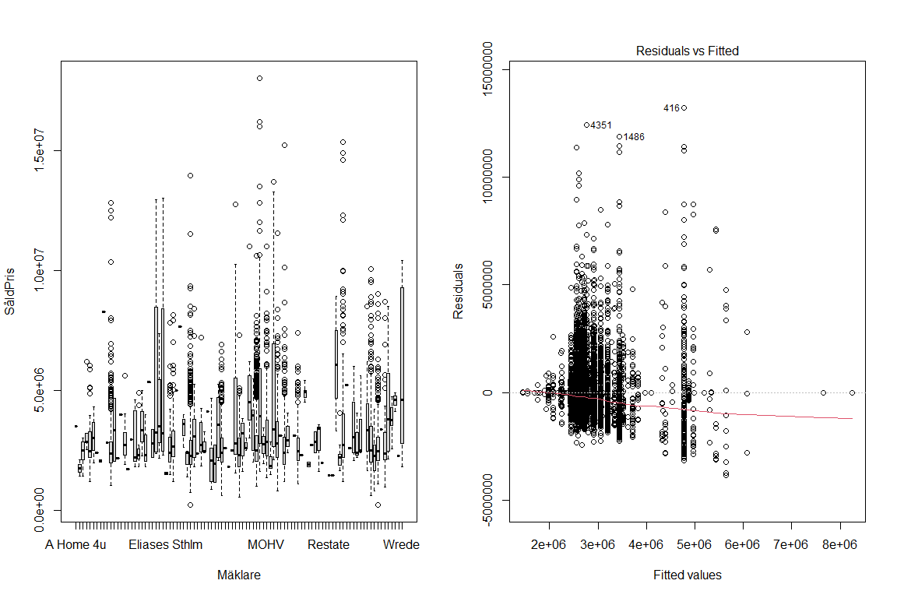

### 1.1.2 Mäklare efter sammanfogning:

    ## 
    ## Call:
    ## lm(formula = SåldPris ~ Mäklare, data = data_träning)
    ## 
    ## Residuals:
    ##      Min       1Q   Median       3Q      Max 
    ## -3171583  -740587  -277400   437949 13228417 
    ## 
    ## Coefficients:
    ##                                              Estimate Std. Error t value
    ## (Intercept)                                   2602711      49323  52.769
    ## MäklareERA                                      74001     121058   0.611
    ## MäklareErik Olsson Fastighetsförmedling        324377     109733   2.956
    ## MäklareFastighetsbyrån                         -47024      57167  -0.823
    ## MäklareHusmanHagberg                            -8175      68359  -0.120
    ## MäklareJägholm Norrortsmäklarna               -163357      93381  -1.749
    ## MäklareLänsförsäkringar Fastighetsförmedling   109340      55406   1.973
    ## MäklareMagnusson Mäkleri                      2168872     104501  20.755
    ## MäklareMindre Mäklarfirmor                     732578      69399  10.556
    ## MäklareMOHV                                    603908      82002   7.365
    ## MäklareMäklarhuset                             453833      73678   6.160
    ## MäklareMäklarringen                            161863      84038   1.926
    ## MäklareNotar                                    57559      74001   0.778
    ## MäklareSkandiaMäklarna                         843414      83464  10.105
    ## MäklareSvensk Fastighetsförmedling             301847      65287   4.623
    ## MäklareSvenska Mäklarhuset                      68123      72869   0.935
    ##                                              Pr(>|t|)    
    ## (Intercept)                                   < 2e-16 ***
    ## MäklareERA                                    0.54102    
    ## MäklareErik Olsson Fastighetsförmedling       0.00312 ** 
    ## MäklareFastighetsbyrån                        0.41077    
    ## MäklareHusmanHagberg                          0.90481    
    ## MäklareJägholm Norrortsmäklarna               0.08026 .  
    ## MäklareLänsförsäkringar Fastighetsförmedling  0.04848 *  
    ## MäklareMagnusson Mäkleri                      < 2e-16 ***
    ## MäklareMindre Mäklarfirmor                    < 2e-16 ***
    ## MäklareMOHV                                  1.91e-13 ***
    ## MäklareMäklarhuset                           7.56e-10 ***
    ## MäklareMäklarringen                           0.05412 .  
    ## MäklareNotar                                  0.43670    
    ## MäklareSkandiaMäklarna                        < 2e-16 ***
    ## MäklareSvensk Fastighetsförmedling           3.82e-06 ***
    ## MäklareSvenska Mäklarhuset                    0.34988    
    ## ---
    ## Signif. codes:  0 '***' 0.001 '**' 0.01 '*' 0.05 '.' 0.1 ' ' 1
    ## 
    ## Residual standard error: 1236000 on 10270 degrees of freedom
    ## Multiple R-squared:  0.07978,    Adjusted R-squared:  0.07843 
    ## F-statistic: 59.35 on 15 and 10270 DF,  p-value: < 2.2e-16

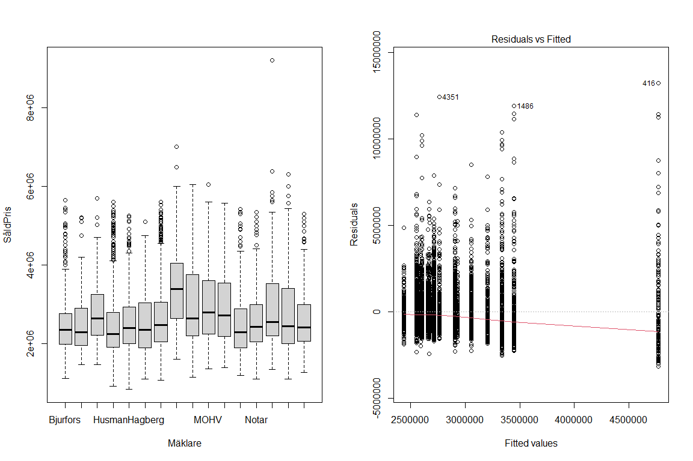

### 1.1.3 Rum:

    ## 
    ## Call:
    ## lm(formula = SåldPris ~ Rum, data = data_träning)
    ## 
    ## Residuals:
    ##      Min       1Q   Median       3Q      Max 
    ## -7538333  -508118  -108118   341882 14091882 
    ## 
    ## Coefficients:
    ##             Estimate Std. Error t value Pr(>|t|)    
    ## (Intercept)  1774136      26854  66.066  < 2e-16 ***
    ## Rum1.5        203646      65964   3.087  0.00203 ** 
    ## Rum2          572846      31848  17.987  < 2e-16 ***
    ## Rum2.5        718035      92583   7.756 9.63e-15 ***
    ## Rum3         1168792      31897  36.642  < 2e-16 ***
    ## Rum3.5       1302531     108721  11.981  < 2e-16 ***
    ## Rum4         2133982      37195  57.374  < 2e-16 ***
    ## Rum4.5       2881419     165963  17.362  < 2e-16 ***
    ## Rum5         3319876      59958  55.370  < 2e-16 ***
    ## Rum5.5       2985864     695362   4.294 1.77e-05 ***
    ## Rum6         4238786     115159  36.808  < 2e-16 ***
    ## Rum7         6764197     328651  20.582  < 2e-16 ***
    ## ---
    ## Signif. codes:  0 '***' 0.001 '**' 0.01 '*' 0.05 '.' 0.1 ' ' 1
    ## 
    ## Residual standard error: 982700 on 10274 degrees of freedom
    ## Multiple R-squared:  0.4182, Adjusted R-squared:  0.4175 
    ## F-statistic: 671.2 on 11 and 10274 DF,  p-value: < 2.2e-16

### 1.1.4 ByggÅr innan sammanfogning:

    ## 
    ## Call:
    ## lm(formula = SåldPris ~ ByggÅr, data = data_träning)
    ## 
    ## Residuals:
    ##      Min       1Q   Median       3Q      Max 
    ## -7725000  -687281  -214011   394362 15087722 
    ## 
    ## Coefficients:
    ##             Estimate Std. Error t value Pr(>|t|)    
    ## (Intercept)  1335000    1164236   1.147 0.251543    
    ## ByggÅr1820   8165000    1646478   4.959 7.20e-07 ***
    ## ByggÅr1830   2390000    1425892   1.676 0.093741 .  
    ## ByggÅr1870   3915000    1425892   2.746 0.006050 ** 
    ## ByggÅr1880   3165000    1646478   1.922 0.054598 .  
    ## ByggÅr1889    315000    1646478   0.191 0.848281    
    ## ByggÅr1892  13565000    1646478   8.239  < 2e-16 ***
    ## ByggÅr1893  11090000    1301655   8.520  < 2e-16 ***
    ## ByggÅr1895   6765000    1646478   4.109 4.01e-05 ***
    ## ByggÅr1897   4415000    1646478   2.681 0.007342 ** 
    ## ByggÅr1898   5001875    1234859   4.051 5.15e-05 ***
    ## ByggÅr1899   3665000    1646478   2.226 0.026038 *  
    ## ByggÅr1900   4051500    1221061   3.318 0.000910 ***
    ## ByggÅr1901   1085385    1208185   0.898 0.369015    
    ## ByggÅr1902   2113333    1344344   1.572 0.115977    
    ## ByggÅr1903   2015000    1646478   1.224 0.221047    
    ## ByggÅr1904   1794194    1182865   1.517 0.129343    
    ## ByggÅr1905   8715000    1646478   5.293 1.23e-07 ***
    ## ByggÅr1906   3601000    1202418   2.995 0.002753 ** 
    ## ByggÅr1907   8095833    1257519   6.438 1.27e-10 ***
    ## ByggÅr1908  10215000    1646478   6.204 5.71e-10 ***
    ## ByggÅr1909   7692000    1275357   6.031 1.68e-09 ***
    ## ByggÅr1911   5615000    1646478   3.410 0.000651 ***
    ## ByggÅr1912   1630714    1244621   1.310 0.190154    
    ## ByggÅr1914   7865000    1646478   4.777 1.81e-06 ***
    ## ByggÅr1917   2665000    1646478   1.619 0.105563    
    ## ByggÅr1920   5165000    1646478   3.137 0.001712 ** 
    ## ByggÅr1922   3065000    1646478   1.862 0.062696 .  
    ## ByggÅr1923   5615000    1646478   3.410 0.000651 ***
    ## ByggÅr1924   2275000    1425892   1.595 0.110633    
    ## ByggÅr1925    996667    1344344   0.741 0.458482    
    ## ByggÅr1927   1581667    1344344   1.177 0.239409    
    ## ByggÅr1929   5122000    1275357   4.016 5.96e-05 ***
    ## ByggÅr1930   3296250    1301655   2.532 0.011345 *  
    ## ByggÅr1934   2565000    1425892   1.799 0.072068 .  
    ## ByggÅr1935    851000    1275357   0.667 0.504618    
    ## ByggÅr1936   5165000    1425892   3.622 0.000293 ***
    ## ByggÅr1938   2079427    1197989   1.736 0.082636 .  
    ## ByggÅr1939   1530484    1182865   1.294 0.195737    
    ## ByggÅr1940   2915000    1425892   2.044 0.040946 *  
    ## ByggÅr1941   1287500    1301655   0.989 0.322625    
    ## ByggÅr1942    840000    1425892   0.589 0.555804    
    ## ByggÅr1943    869091    1216005   0.715 0.474805    
    ## ByggÅr1944    929423    1186414   0.783 0.433417    
    ## ByggÅr1945   2296667    1344344   1.708 0.087594 .  
    ## ByggÅr1946   3541250    1301655   2.721 0.006528 ** 
    ## ByggÅr1947   1135652    1176823   0.965 0.334560    
    ## ByggÅr1948   1415521    1176301   1.203 0.228863    
    ## ByggÅr1949    890217    1189276   0.749 0.454154    
    ## ByggÅr1950    908942    1175377   0.773 0.439351    
    ## ByggÅr1951    996974    1170348   0.852 0.394311    
    ## ByggÅr1952   1279922    1173296   1.091 0.275353    
    ## ByggÅr1953   1403750    1173296   1.196 0.231562    
    ## ByggÅr1954   1404355    1170479   1.200 0.230240    
    ## ByggÅr1955    979081    1170908   0.836 0.403078    
    ## ByggÅr1956   1316250    1170284   1.125 0.260731    
    ## ByggÅr1957   1693509    1169331   1.448 0.147572    
    ## ByggÅr1958   1505557    1167891   1.289 0.197384    
    ## ByggÅr1959   1467423    1168328   1.256 0.209144    
    ## ByggÅr1960    903036    1166313   0.774 0.438792    
    ## ByggÅr1961   1454841    1166248   1.247 0.212260    
    ## ByggÅr1962   1204728    1165993   1.033 0.301525    
    ## ByggÅr1963   1382282    1166175   1.185 0.235922    
    ## ByggÅr1964   1546647    1166544   1.326 0.184923    
    ## ByggÅr1965    699947    1170348   0.598 0.549808    
    ## ByggÅr1966    890268    1174585   0.758 0.448503    
    ## ByggÅr1967   1244229    1166610   1.067 0.286208    
    ## ByggÅr1968   1477318    1166263   1.267 0.205288    
    ## ByggÅr1969   1148755    1166431   0.985 0.324723    
    ## ByggÅr1970   1157632    1167635   0.991 0.321498    
    ## ByggÅr1971    959479    1176301   0.816 0.414705    
    ## ByggÅr1972   1085127    1167187   0.930 0.352552    
    ## ByggÅr1973    699145    1168059   0.599 0.549485    
    ## ByggÅr1974    643125    1170832   0.549 0.582819    
    ## ByggÅr1975    984620    1171581   0.840 0.400693    
    ## ByggÅr1976   1378304    1170546   1.177 0.239028    
    ## ByggÅr1977   1247200    1187292   1.050 0.293533    
    ## ByggÅr1978   1046875    1234859   0.848 0.396587    
    ## ByggÅr1979    978182    1190402   0.822 0.411253    
    ## ByggÅr1980   1440444    1177101   1.224 0.221085    
    ## ByggÅr1981   1140313    1169422   0.975 0.329530    
    ## ByggÅr1982   1847509    1174772   1.573 0.115830    
    ## ByggÅr1983   1008234    1167717   0.863 0.387925    
    ## ByggÅr1984    923234    1171772   0.788 0.430776    
    ## ByggÅr1985   1104717    1169287   0.945 0.344794    
    ## ByggÅr1986   1439460    1169469   1.231 0.218401    
    ## ByggÅr1987   1442009    1169664   1.233 0.217664    
    ## ByggÅr1988   1222805    1178348   1.038 0.299421    
    ## ByggÅr1989    835090    1167312   0.715 0.474381    
    ## ByggÅr1990    919083    1173898   0.783 0.433685    
    ## ByggÅr1991   1040652    1170546   0.889 0.374007    
    ## ByggÅr1992    749557    1171581   0.640 0.522329    
    ## ByggÅr1993   1950193    1171228   1.665 0.095927 .  
    ## ByggÅr1994   1700965    1174404   1.448 0.147546    
    ## ByggÅr1995   1983250    1192987   1.662 0.096459 .  
    ## ByggÅr1996   1357632    1194481   1.137 0.255738    
    ## ByggÅr1997   1546429    1244621   1.242 0.214085    
    ## ByggÅr1998   1493429    1180751   1.265 0.205967    
    ## ByggÅr1999   2031667    1185600   1.714 0.086629 .  
    ## ByggÅr2000   1657000    1180751   1.403 0.160545    
    ## ByggÅr2001   1579481    1171772   1.348 0.177707    
    ## ByggÅr2002   2258750    1184844   1.906 0.056630 .  
    ## ByggÅr2003   2547460    1173440   2.171 0.029959 *  
    ## ByggÅr2004   1586548    1178014   1.347 0.178075    
    ## ByggÅr2005   1717407    1169614   1.468 0.142039    
    ## ByggÅr2006   1831628    1175595   1.558 0.119254    
    ## ByggÅr2007   1672222    1177101   1.421 0.155456    
    ## ByggÅr2008   2200302    1169243   1.882 0.059889 .  
    ## ByggÅr2009   2267540    1168847   1.940 0.052410 .  
    ## ByggÅr2010   2152708    1176301   1.830 0.067269 .  
    ## ByggÅr2011   2016282    1169201   1.724 0.084649 .  
    ## ByggÅr2012   2365238    1169985   2.022 0.043244 *  
    ## ByggÅr2013   2275433    1168572   1.947 0.051539 .  
    ## ByggÅr2014   2011750    1168921   1.721 0.085276 .  
    ## ByggÅr2015   1913926    1167005   1.640 0.101029    
    ## ByggÅr2016   1851519    1166077   1.588 0.112358    
    ## ByggÅr2017   1761690    1165570   1.511 0.130707    
    ## ByggÅr2018   1205488    1165791   1.034 0.301137    
    ## ByggÅr2019   1532259    1167577   1.312 0.189435    
    ## ByggÅr2020   1606883    1168010   1.376 0.168931    
    ## ByggÅr2021   2198584    1169376   1.880 0.060118 .  
    ## ByggÅr2022    960000    1646478   0.583 0.559864    
    ## ByggÅrOkänd  1577278    1164729   1.354 0.175702    
    ## ---
    ## Signif. codes:  0 '***' 0.001 '**' 0.01 '*' 0.05 '.' 0.1 ' ' 1
    ## 
    ## Residual standard error: 1164000 on 10163 degrees of freedom
    ## Multiple R-squared:  0.1921, Adjusted R-squared:  0.1824 
    ## F-statistic: 19.81 on 122 and 10163 DF,  p-value: < 2.2e-16

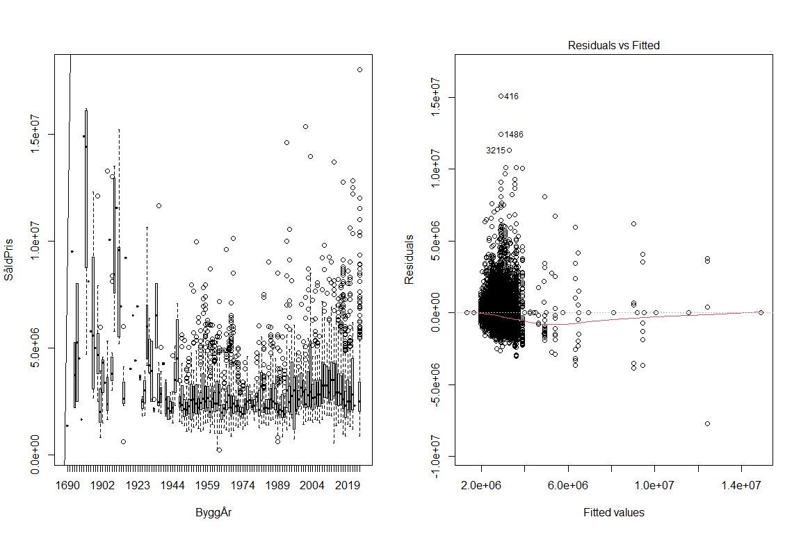

### 1.1.5 ByggÅr efter sammanfogning:

    ## 
    ## Call:
    ## lm(formula = SåldPris ~ ByggÅr, data = data_träning)
    ## 
    ## Residuals:
    ##      Min       1Q   Median       3Q      Max 
    ## -5734062  -740051  -281903   442574 15087722 
    ## 
    ## Coefficients:
    ##                    Estimate Std. Error t value Pr(>|t|)    
    ## (Intercept)         8384063     310336  27.016  < 2e-16 ***
    ## ByggÅr 1900 - 1960 -5644012     311895 -18.096  < 2e-16 ***
    ## ByggÅr 1961 - 1970 -5752160     311417 -18.471  < 2e-16 ***
    ## ByggÅr 1971 - 1980 -6052801     313602 -19.301  < 2e-16 ***
    ## ByggÅr 1981 - 1990 -5914612     312727 -18.913  < 2e-16 ***
    ## ByggÅr 1991 - 2010 -5265307     312472 -16.850  < 2e-16 ***
    ## ByggÅr 2011 - 2022 -5275067     311435 -16.938  < 2e-16 ***
    ## ByggÅr innan 1890  -4017188     537517  -7.474 8.44e-14 ***
    ## ByggÅr Okänd       -5471784     312431 -17.514  < 2e-16 ***
    ## ---
    ## Signif. codes:  0 '***' 0.001 '**' 0.01 '*' 0.05 '.' 0.1 ' ' 1
    ## 
    ## Residual standard error: 1241000 on 10277 degrees of freedom
    ## Multiple R-squared:  0.07122,    Adjusted R-squared:  0.0705 
    ## F-statistic: 98.51 on 8 and 10277 DF,  p-value: < 2.2e-16

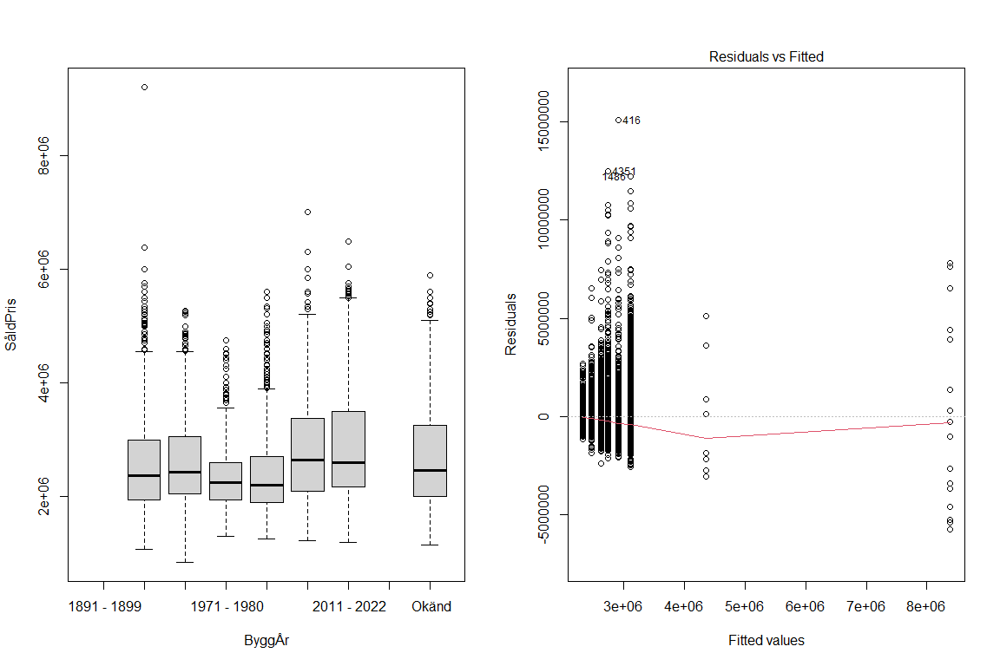

### 1.1.6 Kommun:

    ## 
    ## Call:
    ## lm(formula = SåldPris ~ Kommun, data = data_träning)
    ## 
    ## Residuals:
    ##      Min       1Q   Median       3Q      Max 
    ## -2595644  -656423  -215397   354356 14104356 
    ## 
    ## Coefficients:
    ##                      Estimate Std. Error t value Pr(>|t|)    
    ## (Intercept)           3895644      36323  107.25   <2e-16 ***
    ## KommunSollentuna     -1139221      43327  -26.29   <2e-16 ***
    ## KommunTäby            -831523      41980  -19.81   <2e-16 ***
    ## KommunUpplands Väsby -1760248      46726  -37.67   <2e-16 ***
    ## KommunVallentuna     -1725407      54906  -31.43   <2e-16 ***
    ## KommunVaxholm         -673978      69338   -9.72   <2e-16 ***
    ## KommunÖsteråker      -1533356      56068  -27.35   <2e-16 ***
    ## ---
    ## Signif. codes:  0 '***' 0.001 '**' 0.01 '*' 0.05 '.' 0.1 ' ' 1
    ## 
    ## Residual standard error: 1180000 on 10279 degrees of freedom
    ## Multiple R-squared:  0.1609, Adjusted R-squared:  0.1604 
    ## F-statistic: 328.5 on 6 and 10279 DF,  p-value: < 2.2e-16

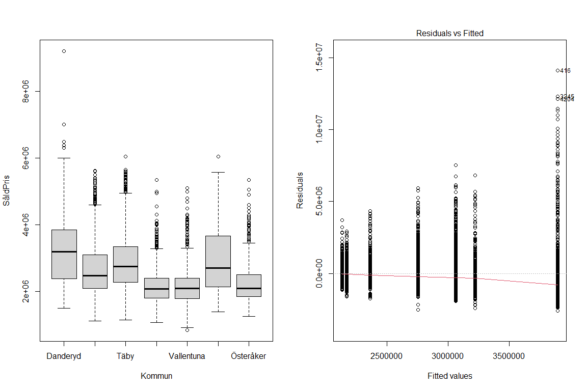

### 1.1.7 AvståndVattenMeter:

    ## 
    ## Call:
    ## lm(formula = SåldPris ~ AvståndVattenMeter, data = data_träning)
    ## 
    ## Residuals:
    ##      Min       1Q   Median       3Q      Max 
    ## -2834544  -741219  -230588   385536 14942038 
    ## 
    ## Coefficients:
    ##                      Estimate Std. Error t value Pr(>|t|)    
    ## (Intercept)         3.170e+06  1.637e+04  193.64   <2e-16 ***
    ## AvståndVattenMeter -1.130e+02  3.485e+00  -32.43   <2e-16 ***
    ## ---
    ## Signif. codes:  0 '***' 0.001 '**' 0.01 '*' 0.05 '.' 0.1 ' ' 1
    ## 
    ## Residual standard error: 1226000 on 10284 degrees of freedom
    ## Multiple R-squared:  0.09278,    Adjusted R-squared:  0.09269 
    ## F-statistic:  1052 on 1 and 10284 DF,  p-value: < 2.2e-16

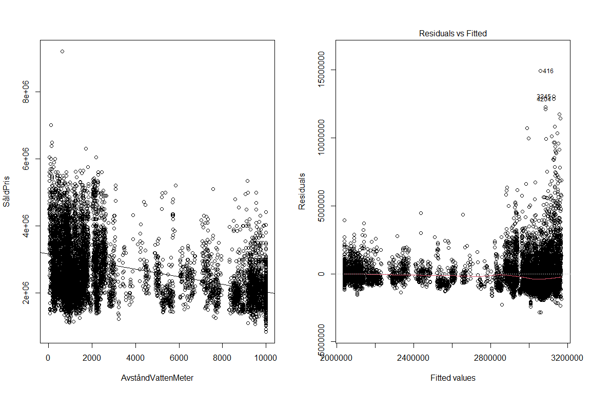

### 1.1.8 Hyra:

    ## 
    ## Call:
    ## lm(formula = SåldPris ~ Hyra, data = data_träning)
    ## 
    ## Residuals:
    ##      Min       1Q   Median       3Q      Max 
    ## -9854555  -622839  -125906   358828 14355993 
    ## 
    ## Coefficients:
    ##              Estimate Std. Error t value Pr(>|t|)    
    ## (Intercept) 9.685e+05  3.568e+04   27.14   <2e-16 ***
    ## Hyra        4.785e+02  8.795e+00   54.41   <2e-16 ***
    ## ---
    ## Signif. codes:  0 '***' 0.001 '**' 0.01 '*' 0.05 '.' 0.1 ' ' 1
    ## 
    ## Residual standard error: 1135000 on 10284 degrees of freedom
    ## Multiple R-squared:  0.2235, Adjusted R-squared:  0.2235 
    ## F-statistic:  2961 on 1 and 10284 DF,  p-value: < 2.2e-16

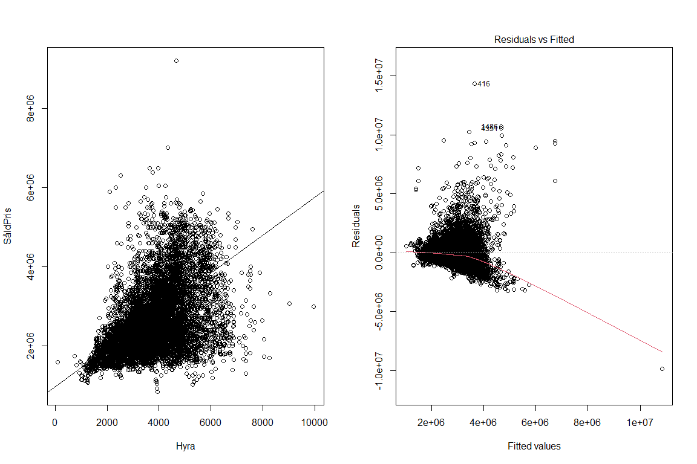

### 1.1.9 BoArea:

    ## 
    ## Call:
    ## lm(formula = SåldPris ~ BoArea, data = data_träning)
    ## 
    ## Residuals:
    ##      Min       1Q   Median       3Q      Max 
    ## -7976884  -562917   -68220   409899 12158845 
    ## 
    ## Coefficients:
    ##             Estimate Std. Error t value Pr(>|t|)    
    ## (Intercept) 410563.0    27297.6   15.04   <2e-16 ***
    ## BoArea       35036.1      374.3   93.61   <2e-16 ***
    ## ---
    ## Signif. codes:  0 '***' 0.001 '**' 0.01 '*' 0.05 '.' 0.1 ' ' 1
    ## 
    ## Residual standard error: 946100 on 10284 degrees of freedom
    ## Multiple R-squared:  0.4601, Adjusted R-squared:   0.46 
    ## F-statistic:  8763 on 1 and 10284 DF,  p-value: < 2.2e-16

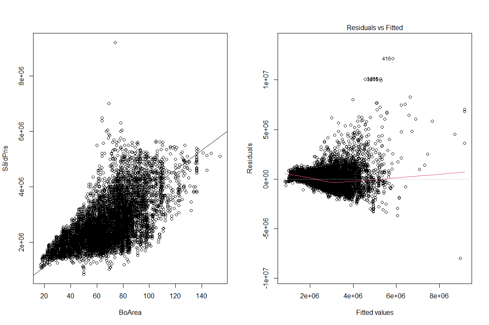

### 1.1.10 ListPris:

    ## 
    ## Call:
    ## lm(formula = SåldPris ~ ListPris, data = data_träning)
    ## 
    ## Residuals:
    ##      Min       1Q   Median       3Q      Max 
    ## -1273830  -112010   -46076    92476  2759523 
    ## 
    ## Coefficients:
    ##              Estimate Std. Error t value Pr(>|t|)    
    ## (Intercept) 6.355e+04  4.814e+03    13.2   <2e-16 ***
    ## ListPris    1.018e+00  1.617e-03   629.1   <2e-16 ***
    ## ---
    ## Signif. codes:  0 '***' 0.001 '**' 0.01 '*' 0.05 '.' 0.1 ' ' 1
    ## 
    ## Residual standard error: 204900 on 10284 degrees of freedom
    ## Multiple R-squared:  0.9747, Adjusted R-squared:  0.9747 
    ## F-statistic: 3.957e+05 on 1 and 10284 DF,  p-value: < 2.2e-16

### 1.1.11 Våning innan sammanfogning:

    ## 
    ## Call:
    ## lm(formula = SåldPris ~ Våning, data = data_träning)
    ## 
    ## Residuals:
    ##      Min       1Q   Median       3Q      Max 
    ## -2745921  -770921  -321272   412471 15346388 
    ## 
    ## Coefficients:
    ##             Estimate Std. Error t value Pr(>|t|)    
    ## (Intercept)  3158333     735967   4.291 1.79e-05 ***
    ## Våning0      -504721     738116  -0.684    0.494    
    ## Våning0.5    -572471     754761  -0.758    0.448    
    ## Våning1      -542061     736413  -0.736    0.462    
    ## Våning1.2     604167    1163666   0.519    0.604    
    ## Våning1.5    -768387     810996  -0.947    0.343    
    ## Våning10     -519105     755086  -0.687    0.492    
    ## Våning11     -378191     766860  -0.493    0.622    
    ## Våning12      146488     774391   0.189    0.850    
    ## Våning13     -112583     789237  -0.143    0.887    
    ## Våning14     -235167     771889  -0.305    0.761    
    ## Våning15       -3533     778874  -0.005    0.996    
    ## Våning16     1059167     862998   1.227    0.220    
    ## Våning16.5  -1008333    1471934  -0.685    0.493    
    ## Våning17.5   1541667    1471934   1.047    0.295    
    ## Våning2      -419358     736423  -0.569    0.569    
    ## Våning2.5    -413333     930933  -0.444    0.657    
    ## Våning3      -370804     736706  -0.503    0.615    
    ## Våning30.5  -1758333    1471934  -1.195    0.232    
    ## Våning4       -92551     737533  -0.125    0.900    
    ## Våning4.5   -1108333    1471934  -0.753    0.451    
    ## Våning5        51045     738466   0.069    0.945    
    ## Våning5.5    -363333    1471934  -0.247    0.805    
    ## Våning6        30467     739764   0.041    0.967    
    ## Våning6.5    -455000    1040815  -0.437    0.662    
    ## Våning7       -33261     741255  -0.045    0.964    
    ## Våning75.5    541667    1471934   0.368    0.713    
    ## Våning8       -41901     743867  -0.056    0.955    
    ## Våning9      -322726     746213  -0.432    0.665    
    ## VåningOkänd  -187412     736883  -0.254    0.799    
    ## ---
    ## Signif. codes:  0 '***' 0.001 '**' 0.01 '*' 0.05 '.' 0.1 ' ' 1
    ## 
    ## Residual standard error: 1275000 on 10256 degrees of freedom
    ## Multiple R-squared:  0.02258,    Adjusted R-squared:  0.01982 
    ## F-statistic: 8.172 on 29 and 10256 DF,  p-value: < 2.2e-16

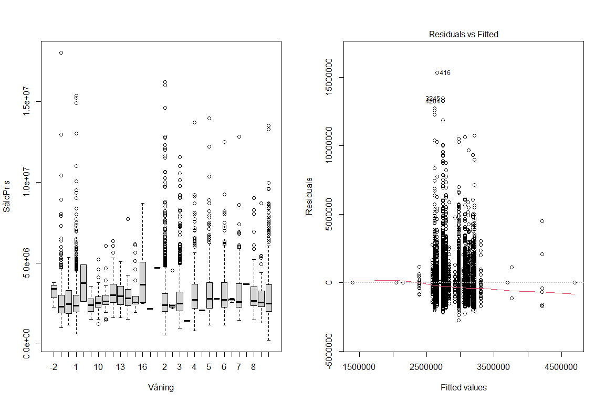

### 1.1.12 Våning efter sammanfogning:

    ## 
    ## Call:
    ## lm(formula = SåldPris ~ Våning, data = data_träning)
    ## 
    ## Residuals:
    ##      Min       1Q   Median       3Q      Max 
    ## -2745921  -770921  -343315   407523 15377803 
    ## 
    ## Coefficients:
    ##                   Estimate Std. Error t value Pr(>|t|)    
    ## (Intercept)        2622197      23143 113.304  < 2e-16 ***
    ## Våning 12 till 15   484745     128289   3.779 0.000159 ***
    ## Våning 2 till 6     236188      29012   8.141 4.37e-16 ***
    ## Våning 7 till 11    371118      59492   6.238 4.60e-10 ***
    ## Våning Okänd        348724      43550   8.007 1.30e-15 ***
    ## Våning Över 15     1185303     370411   3.200 0.001379 ** 
    ## ---
    ## Signif. codes:  0 '***' 0.001 '**' 0.01 '*' 0.05 '.' 0.1 ' ' 1
    ## 
    ## Residual standard error: 1281000 on 10280 degrees of freedom
    ## Multiple R-squared:  0.01121,    Adjusted R-squared:  0.01073 
    ## F-statistic:  23.3 on 5 and 10280 DF,  p-value: < 2.2e-16

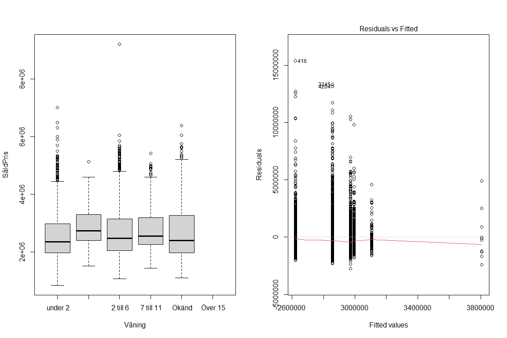

### 1.1.13 SåldSäsong:

    ## 
    ## Call:
    ## lm(formula = SåldPris ~ SåldSäsong, data = data_träning)
    ## 
    ## Residuals:
    ##      Min       1Q   Median       3Q      Max 
    ## -2516599  -789136  -339136   408401 15258401 
    ## 
    ## Coefficients:
    ##                  Estimate Std. Error t value Pr(>|t|)    
    ## (Intercept)       2884807      22632 127.469  < 2e-16 ***
    ## SåldSäsongSommar  -143208      35081  -4.082 4.49e-05 ***
    ## SåldSäsongVinter   -95672      36805  -2.599  0.00935 ** 
    ## SåldSäsongVår      -82861      33265  -2.491  0.01276 *  
    ## ---
    ## Signif. codes:  0 '***' 0.001 '**' 0.01 '*' 0.05 '.' 0.1 ' ' 1
    ## 
    ## Residual standard error: 1287000 on 10282 degrees of freedom
    ## Multiple R-squared:  0.001751,   Adjusted R-squared:  0.00146 
    ## F-statistic: 6.013 on 3 and 10282 DF,  p-value: 0.0004349

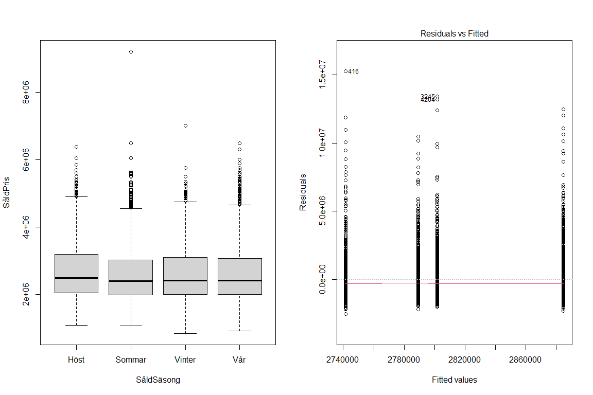

### 1.1.14 AreaPerRum:

    ## 
    ## Call:
    ## lm(formula = SåldPris ~ AreaPerRum, data = data_träning)
    ## 
    ## Residuals:
    ##      Min       1Q   Median       3Q      Max 
    ## -2987230  -753865  -337688   385129 15518627 
    ## 
    ## Coefficients:
    ##             Estimate Std. Error t value Pr(>|t|)    
    ## (Intercept)  3581207      68744   52.09   <2e-16 ***
    ## AreaPerRum    -28383       2494  -11.38   <2e-16 ***
    ## ---
    ## Signif. codes:  0 '***' 0.001 '**' 0.01 '*' 0.05 '.' 0.1 ' ' 1
    ## 
    ## Residual standard error: 1280000 on 10284 degrees of freedom
    ## Multiple R-squared:  0.01244,    Adjusted R-squared:  0.01235 
    ## F-statistic: 129.6 on 1 and 10284 DF,  p-value: < 2.2e-16

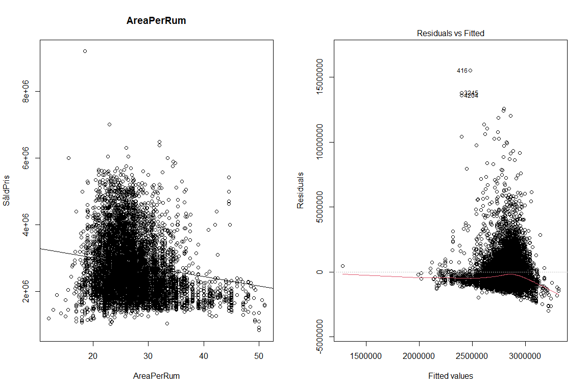

### 1.1.15 PrisPerKvm:

    ## 
    ## Call:
    ## lm(formula = SåldPris ~ PrisPerKvm, data = data_träning)
    ## 
    ## Residuals:
    ##      Min       1Q   Median       3Q      Max 
    ## -3379997  -615024  -150697   479906 12598863 
    ## 
    ## Coefficients:
    ##              Estimate Std. Error t value Pr(>|t|)    
    ## (Intercept) 1.277e+06  3.951e+04   32.32   <2e-16 ***
    ## PrisPerKvm  3.587e+01  8.812e-01   40.70   <2e-16 ***
    ## ---
    ## Signif. codes:  0 '***' 0.001 '**' 0.01 '*' 0.05 '.' 0.1 ' ' 1
    ## 
    ## Residual standard error: 1195000 on 10284 degrees of freedom
    ## Multiple R-squared:  0.1387, Adjusted R-squared:  0.1387 
    ## F-statistic:  1657 on 1 and 10284 DF,  p-value: < 2.2e-16

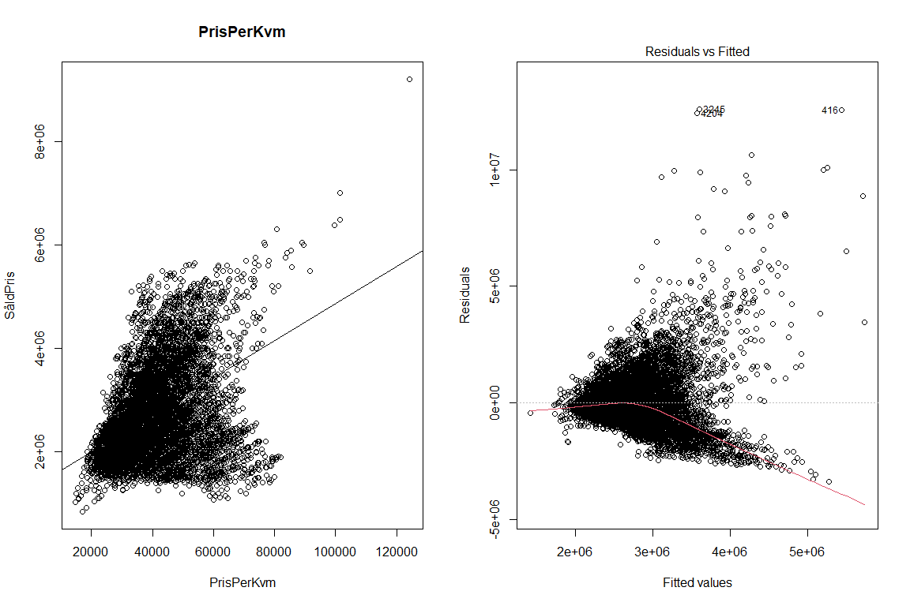

### 1.1.16 HyraPerKvm:

    ## 
    ## Call:
    ## lm(formula = SåldPris ~ HyraPerKvm, data = data_träning)
    ## 
    ## Residuals:
    ##      Min       1Q   Median       3Q      Max 
    ## -3977157  -687769  -223667   371819 14092970 
    ## 
    ## Coefficients:
    ##             Estimate Std. Error t value Pr(>|t|)    
    ## (Intercept)  5714539      64054   89.22   <2e-16 ***
    ## HyraPerKvm    -50110       1088  -46.07   <2e-16 ***
    ## ---
    ## Signif. codes:  0 '***' 0.001 '**' 0.01 '*' 0.05 '.' 0.1 ' ' 1
    ## 
    ## Residual standard error: 1172000 on 10284 degrees of freedom
    ## Multiple R-squared:  0.1711, Adjusted R-squared:  0.171 
    ## F-statistic:  2122 on 1 and 10284 DF,  p-value: < 2.2e-16

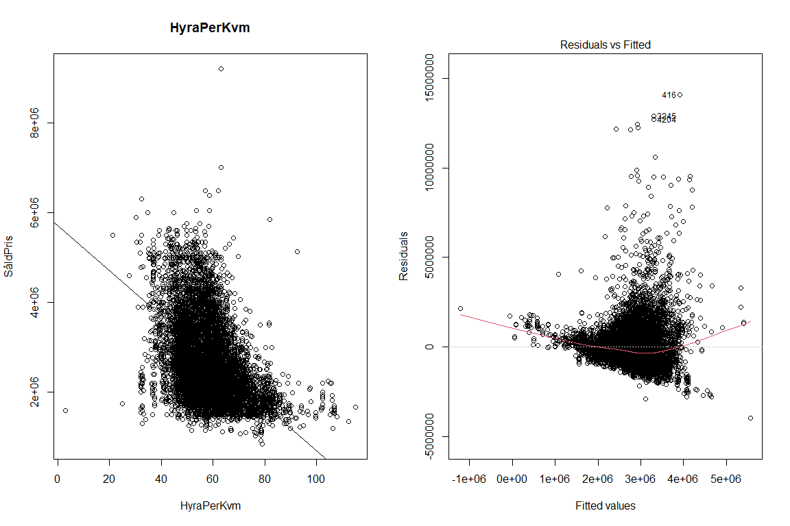

1.2 Modeller:
-------------

### 1.2.1 Modell 1, innan borttagning av outliers:

    ## 
    ## Call:
    ## lm(formula = SåldPris ~ Mäklare + Rum + ByggÅr + Kommun + AvståndVattenMeter + 
    ##     Våning + SåldSäsong + AreaPerRum + PrisPerKvm + HyraPerKvm, 
    ##     data = data_träning)
    ## 
    ## Residuals:
    ##      Min       1Q   Median       3Q      Max 
    ## -5090959  -117022     4182   108789  6160469 
    ## 
    ## Coefficients:
    ##                                                Estimate Std. Error t value
    ## (Intercept)                                  -5.171e+06  1.244e+05 -41.571
    ## MäklareERA                                    1.713e+04  3.730e+04   0.459
    ## MäklareErik Olsson Fastighetsförmedling      -7.448e+04  3.358e+04  -2.218
    ## MäklareFastighetsbyrån                       -1.259e+04  1.794e+04  -0.702
    ## MäklareHusmanHagberg                         -1.933e+04  2.129e+04  -0.908
    ## MäklareJägholm Norrortsmäklarna               6.463e+04  2.923e+04   2.211
    ## MäklareLänsförsäkringar Fastighetsförmedling -9.614e+03  1.713e+04  -0.561
    ## MäklareMagnusson Mäkleri                      1.882e+05  3.256e+04   5.781
    ## MäklareMindre Mäklarfirmor                   -9.532e+03  2.164e+04  -0.441
    ## MäklareMOHV                                  -1.562e+04  2.571e+04  -0.607
    ## MäklareMäklarhuset                           -3.921e+04  2.511e+04  -1.561
    ## MäklareMäklarringen                           4.708e+04  2.624e+04   1.794
    ## MäklareNotar                                  4.960e+03  2.306e+04   0.215
    ## MäklareSkandiaMäklarna                        6.542e+04  2.552e+04   2.563
    ## MäklareSvensk Fastighetsförmedling           -4.810e+04  2.079e+04  -2.314
    ## MäklareSvenska Mäklarhuset                    6.456e+02  2.292e+04   0.028
    ## Rum1.5                                        1.366e+06  2.638e+04  51.796
    ## Rum2                                          2.198e+06  1.580e+04 139.147
    ## Rum2.5                                        2.899e+06  3.757e+04  77.165
    ## Rum3                                          3.444e+06  1.870e+04 184.121
    ## Rum3.5                                        3.911e+06  4.425e+04  88.385
    ## Rum4                                          4.440e+06  2.143e+04 207.241
    ## Rum4.5                                        4.989e+06  6.532e+04  76.380
    ## Rum5                                          5.528e+06  2.907e+04 190.198
    ## Rum5.5                                        5.556e+06  2.626e+05  21.159
    ## Rum6                                          6.458e+06  4.855e+04 133.008
    ## Rum7                                          8.186e+06  1.254e+05  65.275
    ## ByggÅr 1900 - 1960                           -1.681e+06  9.499e+04 -17.701
    ## ByggÅr 1961 - 1970                           -1.726e+06  9.513e+04 -18.139
    ## ByggÅr 1971 - 1980                           -1.800e+06  9.573e+04 -18.801
    ## ByggÅr 1981 - 1990                           -1.800e+06  9.540e+04 -18.867
    ## ByggÅr 1991 - 2010                           -1.728e+06  9.505e+04 -18.183
    ## ByggÅr 2011 - 2022                           -1.778e+06  9.495e+04 -18.727
    ## ByggÅr innan 1890                            -1.326e+06  1.613e+05  -8.221
    ## ByggÅr Okänd                                 -1.750e+06  9.517e+04 -18.385
    ## KommunSollentuna                              1.282e+05  1.789e+04   7.166
    ## KommunTäby                                    8.356e+04  1.680e+04   4.973
    ## KommunUpplands Väsby                          1.788e+05  3.392e+04   5.271
    ## KommunVallentuna                              1.156e+05  3.549e+04   3.258
    ## KommunVaxholm                                 1.405e+05  2.614e+04   5.374
    ## KommunÖsteråker                               1.870e+05  2.256e+04   8.288
    ## AvståndVattenMeter                            6.198e+00  3.389e+00   1.829
    ## Våning 12 till 15                            -3.572e+04  3.784e+04  -0.944
    ## Våning 2 till 6                              -2.577e+03  8.501e+03  -0.303
    ## Våning 7 till 11                             -7.167e+04  1.790e+04  -4.005
    ## Våning Okänd                                 -7.065e+04  1.316e+04  -5.370
    ## Våning Över 15                                1.292e+05  1.072e+05   1.205
    ## SåldSäsongSommar                              2.814e+04  1.012e+04   2.782
    ## SåldSäsongVinter                              4.178e+03  1.060e+04   0.394
    ## SåldSäsongVår                                 1.166e+04  9.591e+03   1.216
    ## AreaPerRum                                    1.221e+05  9.831e+02 124.200
    ## PrisPerKvm                                    8.024e+01  4.980e-01 161.127
    ## HyraPerKvm                                    1.314e+03  4.238e+02   3.101
    ##                                              Pr(>|t|)    
    ## (Intercept)                                   < 2e-16 ***
    ## MäklareERA                                    0.64616    
    ## MäklareErik Olsson Fastighetsförmedling       0.02656 *  
    ## MäklareFastighetsbyrån                        0.48283    
    ## MäklareHusmanHagberg                          0.36393    
    ## MäklareJägholm Norrortsmäklarna               0.02709 *  
    ## MäklareLänsförsäkringar Fastighetsförmedling  0.57466    
    ## MäklareMagnusson Mäkleri                     7.66e-09 ***
    ## MäklareMindre Mäklarfirmor                    0.65955    
    ## MäklareMOHV                                   0.54356    
    ## MäklareMäklarhuset                            0.11845    
    ## MäklareMäklarringen                           0.07287 .  
    ## MäklareNotar                                  0.82972    
    ## MäklareSkandiaMäklarna                        0.01039 *  
    ## MäklareSvensk Fastighetsförmedling            0.02068 *  
    ## MäklareSvenska Mäklarhuset                    0.97753    
    ## Rum1.5                                        < 2e-16 ***
    ## Rum2                                          < 2e-16 ***
    ## Rum2.5                                        < 2e-16 ***
    ## Rum3                                          < 2e-16 ***
    ## Rum3.5                                        < 2e-16 ***
    ## Rum4                                          < 2e-16 ***
    ## Rum4.5                                        < 2e-16 ***
    ## Rum5                                          < 2e-16 ***
    ## Rum5.5                                        < 2e-16 ***
    ## Rum6                                          < 2e-16 ***
    ## Rum7                                          < 2e-16 ***
    ## ByggÅr 1900 - 1960                            < 2e-16 ***
    ## ByggÅr 1961 - 1970                            < 2e-16 ***
    ## ByggÅr 1971 - 1980                            < 2e-16 ***
    ## ByggÅr 1981 - 1990                            < 2e-16 ***
    ## ByggÅr 1991 - 2010                            < 2e-16 ***
    ## ByggÅr 2011 - 2022                            < 2e-16 ***
    ## ByggÅr innan 1890                            2.26e-16 ***
    ## ByggÅr Okänd                                  < 2e-16 ***
    ## KommunSollentuna                             8.24e-13 ***
    ## KommunTäby                                   6.71e-07 ***
    ## KommunUpplands Väsby                         1.38e-07 ***
    ## KommunVallentuna                              0.00113 ** 
    ## KommunVaxholm                                7.85e-08 ***
    ## KommunÖsteråker                               < 2e-16 ***
    ## AvståndVattenMeter                            0.06745 .  
    ## Våning 12 till 15                             0.34531    
    ## Våning 2 till 6                               0.76177    
    ## Våning 7 till 11                             6.25e-05 ***
    ## Våning Okänd                                 8.03e-08 ***
    ## Våning Över 15                                0.22824    
    ## SåldSäsongSommar                              0.00541 ** 
    ## SåldSäsongVinter                              0.69360    
    ## SåldSäsongVår                                 0.22411    
    ## AreaPerRum                                    < 2e-16 ***
    ## PrisPerKvm                                    < 2e-16 ***
    ## HyraPerKvm                                    0.00194 ** 
    ## ---
    ## Signif. codes:  0 '***' 0.001 '**' 0.01 '*' 0.05 '.' 0.1 ' ' 1
    ## 
    ## Residual standard error: 369300 on 10233 degrees of freedom
    ## Multiple R-squared:  0.9181, Adjusted R-squared:  0.9177 
    ## F-statistic:  2207 on 52 and 10233 DF,  p-value: < 2.2e-16

    ##       rstudent unadjusted p-value Bonferroni p
    ## 416   17.05724         2.3842e-64   2.4524e-60
    ## 2211 -14.82397         3.3167e-49   3.4115e-45
    ## 5449  12.45967         2.2358e-35   2.2997e-31
    ## 3245  12.37089         6.6688e-35   6.8595e-31
    ## 1693  11.98350         7.1935e-33   7.3992e-29
    ## 4204  11.98017         7.4838e-33   7.6979e-29
    ## 1486  11.80492         5.9312e-32   6.1008e-28
    ## 4351  11.58624         7.5361e-31   7.7517e-27
    ## 2871  10.94496         1.0006e-27   1.0292e-23
    ## 2734  10.84276         3.0351e-27   3.1219e-23

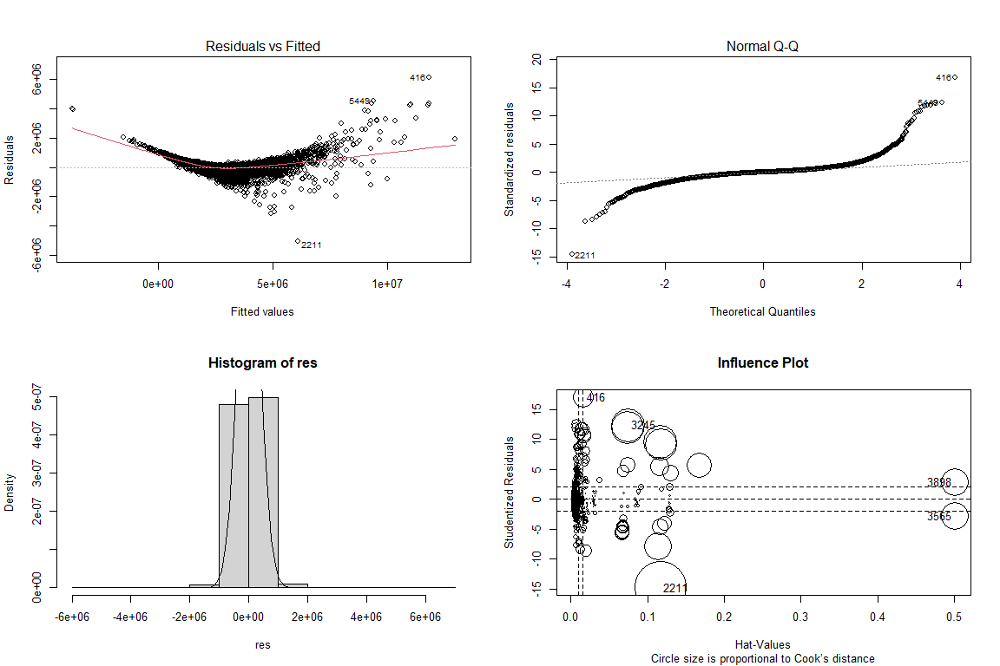

    ##         StudRes        Hat      CookD
    ## 416   17.057240 0.01662838 0.09026916
    ## 2211 -14.823968 0.11686017 0.53716052
    ## 3245  12.370892 0.07468370 0.22964480
    ## 3565  -2.840779 0.50169797 0.15319643
    ## 3898   2.840779 0.50169797 0.15319643

|  skewness|
|---------:|
|  2.118497|

### 1.2.2 Modell 1, efter borttagning av outliers:

    ## 
    ## Call:
    ## lm(formula = SåldPris ~ Mäklare + Rum + ByggÅr + Kommun + AvståndVattenMeter + 
    ##     Våning + SåldSäsong + AreaPerRum + PrisPerKvm + HyraPerKvm, 
    ##     data = data_träning)
    ## 
    ## Residuals:
    ##     Min      1Q  Median      3Q     Max 
    ## -501147  -81392   -6029   80147  501970 
    ## 
    ## Coefficients:
    ##                                                Estimate Std. Error  t value
    ## (Intercept)                                  -5.450e+06  4.005e+04 -136.086
    ## MäklareERA                                    2.070e+04  1.758e+04    1.178
    ## MäklareErik Olsson Fastighetsförmedling       4.293e+03  1.606e+04    0.267
    ## MäklareFastighetsbyrån                        1.052e+04  8.410e+03    1.250
    ## MäklareHusmanHagberg                          2.517e+03  9.951e+03    0.253
    ## MäklareJägholm Norrortsmäklarna               2.077e+04  1.396e+04    1.488
    ## MäklareLänsförsäkringar Fastighetsförmedling  2.016e+04  8.020e+03    2.513
    ## MäklareMagnusson Mäkleri                      3.435e+04  1.744e+04    1.970
    ## MäklareMindre Mäklarfirmor                    2.983e+04  1.045e+04    2.854
    ## MäklareMOHV                                   3.195e+04  1.232e+04    2.593
    ## MäklareMäklarhuset                            2.486e+04  1.184e+04    2.100
    ## MäklareMäklarringen                           3.811e+04  1.243e+04    3.066
    ## MäklareNotar                                  1.455e+04  1.078e+04    1.350
    ## MäklareSkandiaMäklarna                        2.957e+04  1.236e+04    2.392
    ## MäklareSvensk Fastighetsförmedling            1.828e+04  9.846e+03    1.857
    ## MäklareSvenska Mäklarhuset                    9.346e+03  1.080e+04    0.866
    ## Rum1.5                                        1.255e+06  1.296e+04   96.840
    ## Rum2                                          1.983e+06  8.478e+03  233.845
    ## Rum2.5                                        2.600e+06  1.804e+04  144.125
    ## Rum3                                          3.101e+06  1.035e+04  299.518
    ## Rum3.5                                        3.483e+06  2.198e+04  158.464
    ## Rum4                                          3.944e+06  1.214e+04  325.017
    ## Rum5                                          4.800e+06  1.758e+04  273.051
    ## ByggÅr 1961 - 1970                           -4.482e+04  5.994e+03   -7.477
    ## ByggÅr 1971 - 1980                           -9.150e+04  8.086e+03  -11.316
    ## ByggÅr 1981 - 1990                           -6.036e+04  7.482e+03   -8.067
    ## ByggÅr 1991 - 2010                           -1.174e+04  7.474e+03   -1.571
    ## ByggÅr 2011 - 2022                           -2.417e+04  6.682e+03   -3.617
    ## ByggÅr Okänd                                 -1.995e+04  7.113e+03   -2.805
    ## KommunSollentuna                              1.018e+05  8.934e+03   11.400
    ## KommunTäby                                    9.746e+04  8.427e+03   11.566
    ## KommunUpplands Väsby                          1.126e+05  1.652e+04    6.818
    ## KommunVallentuna                              1.018e+05  1.722e+04    5.915
    ## KommunVaxholm                                 1.203e+05  1.302e+04    9.241
    ## KommunÖsteråker                               1.114e+05  1.119e+04    9.954
    ## AvståndVattenMeter                            1.130e+00  1.625e+00    0.696
    ## Våning 12 till 15                            -1.823e+04  1.817e+04   -1.003
    ## Våning 2 till 6                               4.355e+03  4.013e+03    1.085
    ## Våning 7 till 11                             -2.358e+04  8.640e+03   -2.729
    ## Våning Okänd                                 -5.419e+03  6.409e+03   -0.845
    ## SåldSäsongSommar                              4.016e+03  4.829e+03    0.832
    ## SåldSäsongVinter                             -2.585e+03  5.057e+03   -0.511
    ## SåldSäsongVår                                 2.066e+03  4.567e+03    0.452
    ## AreaPerRum                                    1.031e+05  5.397e+02  191.062
    ## PrisPerKvm                                    6.898e+01  2.899e-01  237.911
    ## HyraPerKvm                                   -1.690e+03  2.115e+02   -7.991
    ##                                              Pr(>|t|)    
    ## (Intercept)                                   < 2e-16 ***
    ## MäklareERA                                    0.23900    
    ## MäklareErik Olsson Fastighetsförmedling       0.78929    
    ## MäklareFastighetsbyrån                        0.21123    
    ## MäklareHusmanHagberg                          0.80029    
    ## MäklareJägholm Norrortsmäklarna               0.13691    
    ## MäklareLänsförsäkringar Fastighetsförmedling  0.01198 *  
    ## MäklareMagnusson Mäkleri                      0.04890 *  
    ## MäklareMindre Mäklarfirmor                    0.00432 ** 
    ## MäklareMOHV                                   0.00953 ** 
    ## MäklareMäklarhuset                            0.03580 *  
    ## MäklareMäklarringen                           0.00217 ** 
    ## MäklareNotar                                  0.17708    
    ## MäklareSkandiaMäklarna                        0.01679 *  
    ## MäklareSvensk Fastighetsförmedling            0.06337 .  
    ## MäklareSvenska Mäklarhuset                    0.38676    
    ## Rum1.5                                        < 2e-16 ***
    ## Rum2                                          < 2e-16 ***
    ## Rum2.5                                        < 2e-16 ***
    ## Rum3                                          < 2e-16 ***
    ## Rum3.5                                        < 2e-16 ***
    ## Rum4                                          < 2e-16 ***
    ## Rum5                                          < 2e-16 ***
    ## ByggÅr 1961 - 1970                           8.29e-14 ***
    ## ByggÅr 1971 - 1980                            < 2e-16 ***
    ## ByggÅr 1981 - 1990                           8.07e-16 ***
    ## ByggÅr 1991 - 2010                            0.11622    
    ## ByggÅr 2011 - 2022                            0.00030 ***
    ## ByggÅr Okänd                                  0.00504 ** 
    ## KommunSollentuna                              < 2e-16 ***
    ## KommunTäby                                    < 2e-16 ***
    ## KommunUpplands Väsby                         9.82e-12 ***
    ## KommunVallentuna                             3.43e-09 ***
    ## KommunVaxholm                                 < 2e-16 ***
    ## KommunÖsteråker                               < 2e-16 ***
    ## AvståndVattenMeter                            0.48666    
    ## Våning 12 till 15                             0.31566    
    ## Våning 2 till 6                               0.27788    
    ## Våning 7 till 11                              0.00636 ** 
    ## Våning Okänd                                  0.39789    
    ## SåldSäsongSommar                              0.40559    
    ## SåldSäsongVinter                              0.60918    
    ## SåldSäsongVår                                 0.65100    
    ## AreaPerRum                                    < 2e-16 ***
    ## PrisPerKvm                                    < 2e-16 ***
    ## HyraPerKvm                                   1.50e-15 ***
    ## ---
    ## Signif. codes:  0 '***' 0.001 '**' 0.01 '*' 0.05 '.' 0.1 ' ' 1
    ## 
    ## Residual standard error: 167800 on 9308 degrees of freedom
    ## Multiple R-squared:  0.962,  Adjusted R-squared:  0.9619 
    ## F-statistic:  5243 on 45 and 9308 DF,  p-value: < 2.2e-16

    ## No Studentized residuals with Bonferroni p < 0.05
    ## Largest |rstudent|:
    ##      rstudent unadjusted p-value Bonferroni p
    ## 8973  2.99939          0.0027124           NA

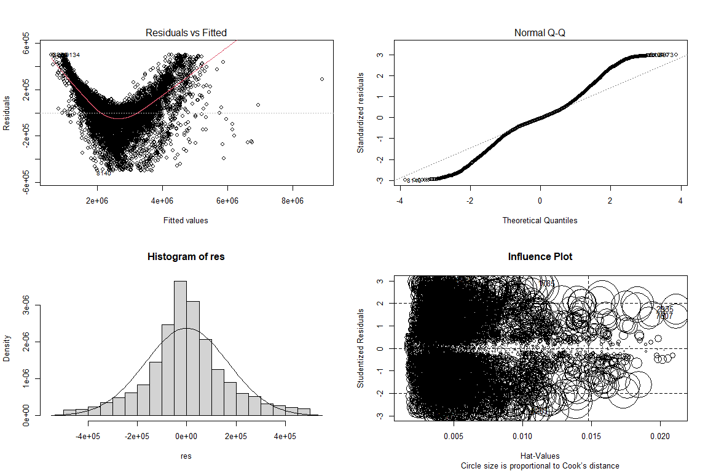

    ##        StudRes         Hat        CookD
    ## 1785  2.878508 0.010926683 0.0019883697
    ## 2935  1.746395 0.021164967 0.0014333088
    ## 7607  1.441010 0.021088918 0.0009723829
    ## 8140 -2.992545 0.003551962 0.0006933720
    ## 8201 -2.766727 0.012046150 0.0020275710
    ## 8973  2.999390 0.004828952 0.0009481791

|   skewness|
|----------:|
|  0.1071339|

### 1.2.3 Modell 2, log-transformation på responsvariabeln:

    ## 
    ## Call:
    ## lm(formula = log(SåldPris) ~ Mäklare + Rum + ByggÅr + Kommun + 
    ##     AvståndVattenMeter + Våning + SåldSäsong + AreaPerRum + PrisPerKvm + 
    ##     HyraPerKvm, data = data_träning)
    ## 
    ## Residuals:
    ##      Min       1Q   Median       3Q      Max 
    ## -0.79376 -0.02025  0.00934  0.02972  0.11841 
    ## 
    ## Coefficients:
    ##                                                Estimate Std. Error  t value
    ## (Intercept)                                   1.200e+01  1.141e-02 1051.109
    ## MäklareERA                                   -3.890e-03  5.011e-03   -0.776
    ## MäklareErik Olsson Fastighetsförmedling       1.654e-03  4.578e-03    0.361
    ## MäklareFastighetsbyrån                       -5.950e-03  2.397e-03   -2.482
    ## MäklareHusmanHagberg                         -7.029e-03  2.836e-03   -2.478
    ## MäklareJägholm Norrortsmäklarna              -1.045e-02  3.980e-03   -2.626
    ## MäklareLänsförsäkringar Fastighetsförmedling  1.108e-04  2.286e-03    0.048
    ## MäklareMagnusson Mäkleri                     -2.687e-02  4.970e-03   -5.407
    ## MäklareMindre Mäklarfirmor                   -4.307e-03  2.979e-03   -1.446
    ## MäklareMOHV                                  -2.701e-03  3.511e-03   -0.769
    ## MäklareMäklarhuset                           -2.241e-03  3.375e-03   -0.664
    ## MäklareMäklarringen                          -1.894e-03  3.543e-03   -0.535
    ## MäklareNotar                                 -2.789e-03  3.072e-03   -0.908
    ## MäklareSkandiaMäklarna                       -8.415e-03  3.524e-03   -2.388
    ## MäklareSvensk Fastighetsförmedling           -4.154e-03  2.806e-03   -1.480
    ## MäklareSvenska Mäklarhuset                    2.944e-03  3.078e-03    0.956
    ## Rum1.5                                        4.515e-01  3.695e-03  122.193
    ## Rum2                                          7.370e-01  2.417e-03  304.969
    ## Rum2.5                                        9.563e-01  5.141e-03  186.004
    ## Rum3                                          1.129e+00  2.951e-03  382.546
    ## Rum3.5                                        1.261e+00  6.265e-03  201.285
    ## Rum4                                          1.402e+00  3.459e-03  405.475
    ## Rum5                                          1.629e+00  5.011e-03  325.079
    ## ByggÅr 1961 - 1970                           -1.366e-02  1.708e-03   -7.996
    ## ByggÅr 1971 - 1980                           -2.278e-02  2.305e-03   -9.882
    ## ByggÅr 1981 - 1990                           -1.597e-02  2.133e-03   -7.487
    ## ByggÅr 1991 - 2010                            6.804e-03  2.130e-03    3.194
    ## ByggÅr 2011 - 2022                            6.602e-03  1.905e-03    3.466
    ## ByggÅr Okänd                                 -3.364e-03  2.027e-03   -1.659
    ## KommunSollentuna                              2.014e-02  2.546e-03    7.911
    ## KommunTäby                                    2.893e-02  2.402e-03   12.044
    ## KommunUpplands Väsby                          1.884e-02  4.708e-03    4.001
    ## KommunVallentuna                              1.483e-02  4.907e-03    3.021
    ## KommunVaxholm                                 2.318e-02  3.711e-03    6.246
    ## KommunÖsteråker                               4.355e-03  3.190e-03    1.365
    ## AvståndVattenMeter                           -2.440e-06  4.630e-07   -5.270
    ## Våning 12 till 15                             1.158e-02  5.178e-03    2.237
    ## Våning 2 till 6                               3.862e-03  1.144e-03    3.376
    ## Våning 7 till 11                              5.578e-03  2.463e-03    2.265
    ## Våning Okänd                                 -4.540e-03  1.827e-03   -2.485
    ## SåldSäsongSommar                             -2.709e-03  1.376e-03   -1.968
    ## SåldSäsongVinter                             -1.520e-03  1.441e-03   -1.055
    ## SåldSäsongVår                                -1.717e-03  1.302e-03   -1.319
    ## AreaPerRum                                    3.550e-02  1.538e-04  230.771
    ## PrisPerKvm                                    2.294e-05  8.264e-08  277.603
    ## HyraPerKvm                                   -1.141e-03  6.029e-05  -18.930
    ##                                              Pr(>|t|)    
    ## (Intercept)                                   < 2e-16 ***
    ## MäklareERA                                   0.437657    
    ## MäklareErik Olsson Fastighetsförmedling      0.717962    
    ## MäklareFastighetsbyrån                       0.013076 *  
    ## MäklareHusmanHagberg                         0.013223 *  
    ## MäklareJägholm Norrortsmäklarna              0.008643 ** 
    ## MäklareLänsförsäkringar Fastighetsförmedling 0.961341    
    ## MäklareMagnusson Mäkleri                     6.57e-08 ***
    ## MäklareMindre Mäklarfirmor                   0.148285    
    ## MäklareMOHV                                  0.441781    
    ## MäklareMäklarhuset                           0.506764    
    ## MäklareMäklarringen                          0.592980    
    ## MäklareNotar                                 0.363941    
    ## MäklareSkandiaMäklarna                       0.016962 *  
    ## MäklareSvensk Fastighetsförmedling           0.138845    
    ## MäklareSvenska Mäklarhuset                   0.338883    
    ## Rum1.5                                        < 2e-16 ***
    ## Rum2                                          < 2e-16 ***
    ## Rum2.5                                        < 2e-16 ***
    ## Rum3                                          < 2e-16 ***
    ## Rum3.5                                        < 2e-16 ***
    ## Rum4                                          < 2e-16 ***
    ## Rum5                                          < 2e-16 ***
    ## ByggÅr 1961 - 1970                           1.44e-15 ***
    ## ByggÅr 1971 - 1980                            < 2e-16 ***
    ## ByggÅr 1981 - 1990                           7.68e-14 ***
    ## ByggÅr 1991 - 2010                           0.001408 ** 
    ## ByggÅr 2011 - 2022                           0.000530 ***
    ## ByggÅr Okänd                                 0.097117 .  
    ## KommunSollentuna                             2.85e-15 ***
    ## KommunTäby                                    < 2e-16 ***
    ## KommunUpplands Väsby                         6.35e-05 ***
    ## KommunVallentuna                             0.002524 ** 
    ## KommunVaxholm                                4.41e-10 ***
    ## KommunÖsteråker                              0.172258    
    ## AvståndVattenMeter                           1.39e-07 ***
    ## Våning 12 till 15                            0.025339 *  
    ## Våning 2 till 6                              0.000739 ***
    ## Våning 7 till 11                             0.023519 *  
    ## Våning Okänd                                 0.012968 *  
    ## SåldSäsongSommar                             0.049071 *  
    ## SåldSäsongVinter                             0.291618    
    ## SåldSäsongVår                                0.187277    
    ## AreaPerRum                                    < 2e-16 ***
    ## PrisPerKvm                                    < 2e-16 ***
    ## HyraPerKvm                                    < 2e-16 ***
    ## ---
    ## Signif. codes:  0 '***' 0.001 '**' 0.01 '*' 0.05 '.' 0.1 ' ' 1
    ## 
    ## Residual standard error: 0.04784 on 9308 degrees of freedom
    ## Multiple R-squared:  0.9755, Adjusted R-squared:  0.9754 
    ## F-statistic:  8230 on 45 and 9308 DF,  p-value: < 2.2e-16

### 1.2.4 Modell 3, log-transformation på alla kontinuerliga förklarande variabler samt responsvariabeln:

    ## 
    ## Call:
    ## lm(formula = log(SåldPris) ~ Mäklare + Rum + ByggÅr + Kommun + 
    ##     log(AvståndVattenMeter) + Våning + SåldSäsong + log(AreaPerRum) + 
    ##     log(PrisPerKvm) + log(HyraPerKvm), data = data_träning)
    ## 
    ## Residuals:
    ##        Min         1Q     Median         3Q        Max 
    ## -3.906e-10 -6.576e-11 -4.800e-13  6.571e-11  3.520e-10 
    ## 
    ## Coefficients:
    ##                                                Estimate Std. Error    t value
    ## (Intercept)                                  -9.506e-12  1.110e-10 -8.600e-02
    ## MäklareERA                                    4.944e-12  1.039e-11  4.760e-01
    ## MäklareErik Olsson Fastighetsförmedling      -1.548e-12  9.485e-12 -1.630e-01
    ## MäklareFastighetsbyrån                        4.118e-12  4.967e-12  8.290e-01
    ## MäklareHusmanHagberg                          7.658e-12  5.878e-12  1.303e+00
    ## MäklareJägholm Norrortsmäklarna              -1.260e-11  8.249e-12 -1.527e+00
    ## MäklareLänsförsäkringar Fastighetsförmedling  2.351e-12  4.738e-12  4.960e-01
    ## MäklareMagnusson Mäkleri                      2.468e-12  1.030e-11  2.400e-01
    ## MäklareMindre Mäklarfirmor                    2.551e-12  6.171e-12  4.130e-01
    ## MäklareMOHV                                   9.481e-13  7.275e-12  1.300e-01
    ## MäklareMäklarhuset                            5.787e-12  6.993e-12  8.270e-01
    ## MäklareMäklarringen                           4.931e-12  7.339e-12  6.720e-01
    ## MäklareNotar                                 -4.762e-12  6.365e-12 -7.480e-01
    ## MäklareSkandiaMäklarna                       -9.210e-12  7.301e-12 -1.262e+00
    ## MäklareSvensk Fastighetsförmedling            2.919e-12  5.816e-12  5.020e-01
    ## MäklareSvenska Mäklarhuset                   -8.788e-13  6.373e-12 -1.380e-01
    ## Rum1.5                                        4.055e-01  7.496e-12  5.409e+10
    ## Rum2                                          6.931e-01  4.655e-12  1.489e+11
    ## Rum2.5                                        9.163e-01  1.042e-11  8.792e+10
    ## Rum3                                          1.099e+00  5.701e-12  1.927e+11
    ## Rum3.5                                        1.253e+00  1.281e-11  9.781e+10
    ## Rum4                                          1.386e+00  6.803e-12  2.038e+11
    ## Rum5                                          1.609e+00  1.015e-11  1.585e+11
    ## ByggÅr 1961 - 1970                            9.327e-12  3.563e-12  2.618e+00
    ## ByggÅr 1971 - 1980                            8.376e-12  4.772e-12  1.755e+00
    ## ByggÅr 1981 - 1990                           -3.795e-12  4.411e-12 -8.600e-01
    ## ByggÅr 1991 - 2010                            8.096e-12  4.400e-12  1.840e+00
    ## ByggÅr 2011 - 2022                            3.103e-12  3.947e-12  7.860e-01
    ## ByggÅr Okänd                                  5.108e-15  4.199e-12  1.000e-03
    ## KommunSollentuna                             -1.730e-11  5.250e-12 -3.295e+00
    ## KommunTäby                                   -1.928e-11  5.135e-12 -3.755e+00
    ## KommunUpplands Väsby                         -1.191e-11  7.802e-12 -1.527e+00
    ## KommunVallentuna                             -1.382e-11  8.219e-12 -1.682e+00
    ## KommunVaxholm                                -3.177e-11  7.842e-12 -4.051e+00
    ## KommunÖsteråker                              -1.884e-11  6.591e-12 -2.859e+00
    ## log(AvståndVattenMeter)                      -5.113e-13  1.856e-12 -2.760e-01
    ## Våning 12 till 15                             1.528e-11  1.073e-11  1.424e+00
    ## Våning 2 till 6                               7.234e-12  2.372e-12  3.049e+00
    ## Våning 7 till 11                              1.171e-11  5.104e-12  2.295e+00
    ## Våning Okänd                                  5.534e-12  3.784e-12  1.462e+00
    ## SåldSäsongSommar                             -3.834e-12  2.852e-12 -1.344e+00
    ## SåldSäsongVinter                             -8.236e-13  2.986e-12 -2.760e-01
    ## SåldSäsongVår                                 2.455e-12  2.697e-12  9.110e-01
    ## log(AreaPerRum)                               1.000e+00  8.715e-12  1.148e+11
    ## log(PrisPerKvm)                               1.000e+00  7.049e-12  1.419e+11
    ## log(HyraPerKvm)                               2.326e-12  7.253e-12  3.210e-01
    ##                                              Pr(>|t|)    
    ## (Intercept)                                  0.931751    
    ## MäklareERA                                   0.634055    
    ## MäklareErik Olsson Fastighetsförmedling      0.870344    
    ## MäklareFastighetsbyrån                       0.407105    
    ## MäklareHusmanHagberg                         0.192649    
    ## MäklareJägholm Norrortsmäklarna              0.126728    
    ## MäklareLänsförsäkringar Fastighetsförmedling 0.619841    
    ## MäklareMagnusson Mäkleri                     0.810517    
    ## MäklareMindre Mäklarfirmor                   0.679307    
    ## MäklareMOHV                                  0.896313    
    ## MäklareMäklarhuset                           0.408008    
    ## MäklareMäklarringen                          0.501665    
    ## MäklareNotar                                 0.454423    
    ## MäklareSkandiaMäklarna                       0.207145    
    ## MäklareSvensk Fastighetsförmedling           0.615787    
    ## MäklareSvenska Mäklarhuset                   0.890322    
    ## Rum1.5                                        < 2e-16 ***
    ## Rum2                                          < 2e-16 ***
    ## Rum2.5                                        < 2e-16 ***
    ## Rum3                                          < 2e-16 ***
    ## Rum3.5                                        < 2e-16 ***
    ## Rum4                                          < 2e-16 ***
    ## Rum5                                          < 2e-16 ***
    ## ByggÅr 1961 - 1970                           0.008856 ** 
    ## ByggÅr 1971 - 1980                           0.079258 .  
    ## ByggÅr 1981 - 1990                           0.389577    
    ## ByggÅr 1991 - 2010                           0.065839 .  
    ## ByggÅr 2011 - 2022                           0.431871    
    ## ByggÅr Okänd                                 0.999029    
    ## KommunSollentuna                             0.000988 ***
    ## KommunTäby                                   0.000175 ***
    ## KommunUpplands Väsby                         0.126795    
    ## KommunVallentuna                             0.092658 .  
    ## KommunVaxholm                                5.13e-05 ***
    ## KommunÖsteråker                              0.004257 ** 
    ## log(AvståndVattenMeter)                      0.782929    
    ## Våning 12 till 15                            0.154572    
    ## Våning 2 till 6                              0.002299 ** 
    ## Våning 7 till 11                             0.021753 *  
    ## Våning Okänd                                 0.143682    
    ## SåldSäsongSommar                             0.178826    
    ## SåldSäsongVinter                             0.782730    
    ## SåldSäsongVår                                0.362565    
    ## log(AreaPerRum)                               < 2e-16 ***
    ## log(PrisPerKvm)                               < 2e-16 ***
    ## log(HyraPerKvm)                              0.748432    
    ## ---
    ## Signif. codes:  0 '***' 0.001 '**' 0.01 '*' 0.05 '.' 0.1 ' ' 1
    ## 
    ## Residual standard error: 9.912e-11 on 9308 degrees of freedom
    ## Multiple R-squared:      1,  Adjusted R-squared:      1 
    ## F-statistic: 1.965e+21 on 45 and 9308 DF,  p-value: < 2.2e-16

### 1.2.5 Modell 4, log-transformation på de omvandlade kontinuerliga variablerna (enligt residual på enkel linjär modell):

    ## 
    ## Call:
    ## lm(formula = log(SåldPris) ~ Mäklare + Rum + ByggÅr + Kommun + 
    ##     AvståndVattenMeter + Våning + SåldSäsong + log(AreaPerRum) + 
    ##     log(PrisPerKvm) + log(HyraPerKvm), data = data_träning)
    ## 
    ## Residuals:
    ##        Min         1Q     Median         3Q        Max 
    ## -3.896e-10 -6.598e-11 -3.700e-13  6.568e-11  3.523e-10 
    ## 
    ## Coefficients:
    ##                                                Estimate Std. Error    t value
    ## (Intercept)                                   1.714e-12  1.096e-10  1.600e-02
    ## MäklareERA                                    4.595e-12  1.038e-11  4.430e-01
    ## MäklareErik Olsson Fastighetsförmedling      -1.566e-12  9.484e-12 -1.650e-01
    ## MäklareFastighetsbyrån                        4.066e-12  4.967e-12  8.190e-01
    ## MäklareHusmanHagberg                          7.677e-12  5.877e-12  1.306e+00
    ## MäklareJägholm Norrortsmäklarna              -1.270e-11  8.249e-12 -1.540e+00
    ## MäklareLänsförsäkringar Fastighetsförmedling  2.316e-12  4.736e-12  4.890e-01
    ## MäklareMagnusson Mäkleri                      2.180e-12  1.028e-11  2.120e-01
    ## MäklareMindre Mäklarfirmor                    2.504e-12  6.170e-12  4.060e-01
    ## MäklareMOHV                                   8.338e-13  7.273e-12  1.150e-01
    ## MäklareMäklarhuset                            5.910e-12  6.992e-12  8.450e-01
    ## MäklareMäklarringen                           4.876e-12  7.339e-12  6.640e-01
    ## MäklareNotar                                 -4.771e-12  6.363e-12 -7.500e-01
    ## MäklareSkandiaMäklarna                       -9.187e-12  7.300e-12 -1.259e+00
    ## MäklareSvensk Fastighetsförmedling            2.915e-12  5.814e-12  5.010e-01
    ## MäklareSvenska Mäklarhuset                   -1.157e-12  6.376e-12 -1.820e-01
    ## Rum1.5                                        4.055e-01  7.498e-12  5.408e+10
    ## Rum2                                          6.931e-01  4.657e-12  1.488e+11
    ## Rum2.5                                        9.163e-01  1.044e-11  8.780e+10
    ## Rum3                                          1.099e+00  5.706e-12  1.925e+11
    ## Rum3.5                                        1.253e+00  1.281e-11  9.781e+10
    ## Rum4                                          1.386e+00  6.813e-12  2.035e+11
    ## Rum5                                          1.609e+00  1.016e-11  1.584e+11
    ## ByggÅr 1961 - 1970                            9.420e-12  3.546e-12  2.657e+00
    ## ByggÅr 1971 - 1980                            8.764e-12  4.777e-12  1.835e+00
    ## ByggÅr 1981 - 1990                           -3.710e-12  4.408e-12 -8.420e-01
    ## ByggÅr 1991 - 2010                            8.291e-12  4.403e-12  1.883e+00
    ## ByggÅr 2011 - 2022                            3.329e-12  3.940e-12  8.450e-01
    ## ByggÅr Okänd                                  1.720e-13  4.196e-12  4.100e-02
    ## KommunSollentuna                             -1.709e-11  5.132e-12 -3.331e+00
    ## KommunTäby                                   -1.859e-11  4.859e-12 -3.825e+00
    ## KommunUpplands Väsby                         -3.698e-12  9.673e-12 -3.820e-01
    ## KommunVallentuna                             -5.411e-12  1.011e-11 -5.350e-01
    ## KommunVaxholm                                -3.207e-11  7.616e-12 -4.211e+00
    ## KommunÖsteråker                              -1.899e-11  6.488e-12 -2.927e+00
    ## AvståndVattenMeter                           -1.214e-15  9.607e-16 -1.263e+00
    ## Våning 12 till 15                             1.527e-11  1.073e-11  1.423e+00
    ## Våning 2 till 6                               7.196e-12  2.371e-12  3.034e+00
    ## Våning 7 till 11                              1.150e-11  5.105e-12  2.253e+00
    ## Våning Okänd                                  5.633e-12  3.785e-12  1.488e+00
    ## SåldSäsongSommar                             -3.770e-12  2.852e-12 -1.322e+00
    ## SåldSäsongVinter                             -8.264e-13  2.986e-12 -2.770e-01
    ## SåldSäsongVår                                 2.524e-12  2.697e-12  9.360e-01
    ## log(AreaPerRum)                               1.000e+00  8.726e-12  1.146e+11
    ## log(PrisPerKvm)                               1.000e+00  7.057e-12  1.417e+11
    ## log(HyraPerKvm)                               2.108e-12  7.253e-12  2.910e-01
    ##                                              Pr(>|t|)    
    ## (Intercept)                                  0.987523    
    ## MäklareERA                                   0.658052    
    ## MäklareErik Olsson Fastighetsförmedling      0.868829    
    ## MäklareFastighetsbyrån                       0.413030    
    ## MäklareHusmanHagberg                         0.191466    
    ## MäklareJägholm Norrortsmäklarna              0.123589    
    ## MäklareLänsförsäkringar Fastighetsförmedling 0.624920    
    ## MäklareMagnusson Mäkleri                     0.832128    
    ## MäklareMindre Mäklarfirmor                   0.684898    
    ## MäklareMOHV                                  0.908734    
    ## MäklareMäklarhuset                           0.398023    
    ## MäklareMäklarringen                          0.506431    
    ## MäklareNotar                                 0.453362    
    ## MäklareSkandiaMäklarna                       0.208218    
    ## MäklareSvensk Fastighetsförmedling           0.616106    
    ## MäklareSvenska Mäklarhuset                   0.855966    
    ## Rum1.5                                        < 2e-16 ***
    ## Rum2                                          < 2e-16 ***
    ## Rum2.5                                        < 2e-16 ***
    ## Rum3                                          < 2e-16 ***
    ## Rum3.5                                        < 2e-16 ***
    ## Rum4                                          < 2e-16 ***
    ## Rum5                                          < 2e-16 ***
    ## ByggÅr 1961 - 1970                           0.007907 ** 
    ## ByggÅr 1971 - 1980                           0.066603 .  
    ## ByggÅr 1981 - 1990                           0.399985    
    ## ByggÅr 1991 - 2010                           0.059706 .  
    ## ByggÅr 2011 - 2022                           0.398134    
    ## ByggÅr Okänd                                 0.967292    
    ## KommunSollentuna                             0.000868 ***
    ## KommunTäby                                   0.000131 ***
    ## KommunUpplands Väsby                         0.702268    
    ## KommunVallentuna                             0.592479    
    ## KommunVaxholm                                2.57e-05 ***
    ## KommunÖsteråker                              0.003432 ** 
    ## AvståndVattenMeter                           0.206546    
    ## Våning 12 till 15                            0.154678    
    ## Våning 2 till 6                              0.002417 ** 
    ## Våning 7 till 11                             0.024276 *  
    ## Våning Okänd                                 0.136687    
    ## SåldSäsongSommar                             0.186264    
    ## SåldSäsongVinter                             0.781992    
    ## SåldSäsongVår                                0.349360    
    ## log(AreaPerRum)                               < 2e-16 ***
    ## log(PrisPerKvm)                               < 2e-16 ***
    ## log(HyraPerKvm)                              0.771297    
    ## ---
    ## Signif. codes:  0 '***' 0.001 '**' 0.01 '*' 0.05 '.' 0.1 ' ' 1
    ## 
    ## Residual standard error: 9.911e-11 on 9308 degrees of freedom
    ## Multiple R-squared:      1,  Adjusted R-squared:      1 
    ## F-statistic: 1.966e+21 on 45 and 9308 DF,  p-value: < 2.2e-16

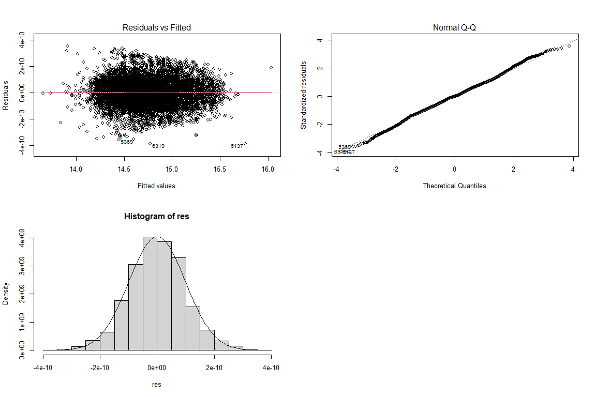

### 1.2.6 Modell 5, log-transformation enligt scatterplott i enkel linjär regression:

    ## 
    ## Call:
    ## lm(formula = log(SåldPris) ~ Mäklare + Rum + ByggÅr + Kommun + 
    ##     AvståndVattenMeter + Våning + SåldSäsong + log(AreaPerRum) + 
    ##     log(PrisPerKvm) + HyraPerKvm, data = data_träning)
    ## 
    ## Residuals:
    ##        Min         1Q     Median         3Q        Max 
    ## -3.893e-10 -6.579e-11 -3.900e-13  6.575e-11  3.525e-10 
    ## 
    ## Coefficients:
    ##                                                Estimate Std. Error    t value
    ## (Intercept)                                   1.802e-11  1.000e-10  1.800e-01
    ## MäklareERA                                    4.588e-12  1.038e-11  4.420e-01
    ## MäklareErik Olsson Fastighetsförmedling      -1.461e-12  9.485e-12 -1.540e-01
    ## MäklareFastighetsbyrån                        4.058e-12  4.967e-12  8.170e-01
    ## MäklareHusmanHagberg                          7.669e-12  5.877e-12  1.305e+00
    ## MäklareJägholm Norrortsmäklarna              -1.274e-11  8.248e-12 -1.544e+00
    ## MäklareLänsförsäkringar Fastighetsförmedling  2.306e-12  4.736e-12  4.870e-01
    ## MäklareMagnusson Mäkleri                      2.199e-12  1.028e-11  2.140e-01
    ## MäklareMindre Mäklarfirmor                    2.493e-12  6.170e-12  4.040e-01
    ## MäklareMOHV                                   8.472e-13  7.273e-12  1.160e-01
    ## MäklareMäklarhuset                            5.899e-12  6.992e-12  8.440e-01
    ## MäklareMäklarringen                           4.852e-12  7.339e-12  6.610e-01
    ## MäklareNotar                                 -4.758e-12  6.363e-12 -7.480e-01
    ## MäklareSkandiaMäklarna                       -9.192e-12  7.300e-12 -1.259e+00
    ## MäklareSvensk Fastighetsförmedling            2.903e-12  5.814e-12  4.990e-01
    ## MäklareSvenska Mäklarhuset                   -1.165e-12  6.376e-12 -1.830e-01
    ## Rum1.5                                        4.055e-01  7.509e-12  5.400e+10
    ## Rum2                                          6.931e-01  4.703e-12  1.474e+11
    ## Rum2.5                                        9.163e-01  1.046e-11  8.757e+10
    ## Rum3                                          1.099e+00  5.779e-12  1.901e+11
    ## Rum3.5                                        1.253e+00  1.285e-11  9.753e+10
    ## Rum4                                          1.386e+00  6.893e-12  2.011e+11
    ## Rum5                                          1.609e+00  1.015e-11  1.585e+11
    ## ByggÅr 1961 - 1970                            9.401e-12  3.546e-12  2.651e+00
    ## ByggÅr 1971 - 1980                            8.782e-12  4.777e-12  1.838e+00
    ## ByggÅr 1981 - 1990                           -3.528e-12  4.415e-12 -7.990e-01
    ## ByggÅr 1991 - 2010                            8.545e-12  4.411e-12  1.937e+00
    ## ByggÅr 2011 - 2022                            3.499e-12  3.935e-12  8.890e-01
    ## ByggÅr Okänd                                  2.503e-13  4.195e-12  6.000e-02
    ## KommunSollentuna                             -1.723e-11  5.140e-12 -3.352e+00
    ## KommunTäby                                   -1.873e-11  4.866e-12 -3.850e+00
    ## KommunUpplands Väsby                         -3.818e-12  9.678e-12 -3.940e-01
    ## KommunVallentuna                             -5.438e-12  1.011e-11 -5.380e-01
    ## KommunVaxholm                                -3.214e-11  7.616e-12 -4.221e+00
    ## KommunÖsteråker                              -1.914e-11  6.495e-12 -2.947e+00
    ## AvståndVattenMeter                           -1.219e-15  9.606e-16 -1.269e+00
    ## Våning 12 till 15                             1.518e-11  1.073e-11  1.414e+00
    ## Våning 2 till 6                               7.227e-12  2.371e-12  3.048e+00
    ## Våning 7 till 11                              1.157e-11  5.103e-12  2.267e+00
    ## Våning Okänd                                  5.592e-12  3.784e-12  1.478e+00
    ## SåldSäsongSommar                             -3.769e-12  2.852e-12 -1.322e+00
    ## SåldSäsongVinter                             -8.264e-13  2.986e-12 -2.770e-01
    ## SåldSäsongVår                                 2.516e-12  2.697e-12  9.330e-01
    ## log(AreaPerRum)                               1.000e+00  8.790e-12  1.138e+11
    ## log(PrisPerKvm)                               1.000e+00  7.072e-12  1.414e+11
    ## HyraPerKvm                                    3.035e-15  1.266e-13  2.400e-02
    ##                                              Pr(>|t|)    
    ## (Intercept)                                  0.857046    
    ## MäklareERA                                   0.658546    
    ## MäklareErik Olsson Fastighetsförmedling      0.877610    
    ## MäklareFastighetsbyrån                       0.413968    
    ## MäklareHusmanHagberg                         0.191901    
    ## MäklareJägholm Norrortsmäklarna              0.122607    
    ## MäklareLänsförsäkringar Fastighetsförmedling 0.626378    
    ## MäklareMagnusson Mäkleri                     0.830683    
    ## MäklareMindre Mäklarfirmor                   0.686182    
    ## MäklareMOHV                                  0.907277    
    ## MäklareMäklarhuset                           0.398831    
    ## MäklareMäklarringen                          0.508504    
    ## MäklareNotar                                 0.454654    
    ## MäklareSkandiaMäklarna                       0.207979    
    ## MäklareSvensk Fastighetsförmedling           0.617612    
    ## MäklareSvenska Mäklarhuset                   0.855011    
    ## Rum1.5                                        < 2e-16 ***
    ## Rum2                                          < 2e-16 ***
    ## Rum2.5                                        < 2e-16 ***
    ## Rum3                                          < 2e-16 ***
    ## Rum3.5                                        < 2e-16 ***
    ## Rum4                                          < 2e-16 ***
    ## Rum5                                          < 2e-16 ***
    ## ByggÅr 1961 - 1970                           0.008040 ** 
    ## ByggÅr 1971 - 1980                           0.066043 .  
    ## ByggÅr 1981 - 1990                           0.424239    
    ## ByggÅr 1991 - 2010                           0.052772 .  
    ## ByggÅr 2011 - 2022                           0.373957    
    ## ByggÅr Okänd                                 0.952425    
    ## KommunSollentuna                             0.000806 ***
    ## KommunTäby                                   0.000119 ***
    ## KommunUpplands Väsby                         0.693244    
    ## KommunVallentuna                             0.590704    
    ## KommunVaxholm                                2.46e-05 ***
    ## KommunÖsteråker                              0.003220 ** 
    ## AvståndVattenMeter                           0.204391    
    ## Våning 12 till 15                            0.157293    
    ## Våning 2 till 6                              0.002308 ** 
    ## Våning 7 till 11                             0.023434 *  
    ## Våning Okänd                                 0.139471    
    ## SåldSäsongSommar                             0.186312    
    ## SåldSäsongVinter                             0.781987    
    ## SåldSäsongVår                                0.350857    
    ## log(AreaPerRum)                               < 2e-16 ***
    ## log(PrisPerKvm)                               < 2e-16 ***
    ## HyraPerKvm                                   0.980879    
    ## ---
    ## Signif. codes:  0 '***' 0.001 '**' 0.01 '*' 0.05 '.' 0.1 ' ' 1
    ## 
    ## Residual standard error: 9.911e-11 on 9308 degrees of freedom
    ## Multiple R-squared:      1,  Adjusted R-squared:      1 
    ## F-statistic: 1.966e+21 on 45 and 9308 DF,  p-value: < 2.2e-16

1.3 Modeller efter stegvis variabelselektion:
---------------------------------------------

### 1.3.1 Modell 1 Stepwise:

    ## 
    ## Call:
    ## lm(formula = SåldPris ~ Rum + ByggÅr + Kommun + Våning + AreaPerRum + 
    ##     PrisPerKvm + HyraPerKvm, data = data_träning)
    ## 
    ## Residuals:
    ##     Min      1Q  Median      3Q     Max 
    ## -509375  -82291   -7003   80641  516443 
    ## 
    ## Coefficients:
    ##                        Estimate Std. Error  t value Pr(>|t|)    
    ## (Intercept)          -5.429e+06  3.854e+04 -140.881  < 2e-16 ***
    ## Rum1.5                1.254e+06  1.288e+04   97.351  < 2e-16 ***
    ## Rum2                  1.983e+06  8.407e+03  235.921  < 2e-16 ***
    ## Rum2.5                2.600e+06  1.788e+04  145.389  < 2e-16 ***
    ## Rum3                  3.102e+06  1.024e+04  303.009  < 2e-16 ***
    ## Rum3.5                3.482e+06  2.192e+04  158.810  < 2e-16 ***
    ## Rum4                  3.945e+06  1.200e+04  328.645  < 2e-16 ***
    ## Rum5                  4.802e+06  1.737e+04  276.435  < 2e-16 ***
    ## ByggÅr 1961 - 1970   -4.455e+04  5.932e+03   -7.511 6.42e-14 ***
    ## ByggÅr 1971 - 1980   -9.073e+04  8.025e+03  -11.306  < 2e-16 ***
    ## ByggÅr 1981 - 1990   -6.018e+04  7.451e+03   -8.077 7.44e-16 ***
    ## ByggÅr 1991 - 2010   -1.216e+04  7.435e+03   -1.636 0.101941    
    ## ByggÅr 2011 - 2022   -2.418e+04  6.609e+03   -3.658 0.000256 ***
    ## ByggÅr Okänd         -1.865e+04  7.001e+03   -2.663 0.007749 ** 
    ## KommunSollentuna      1.000e+05  8.512e+03   11.750  < 2e-16 ***
    ## KommunTäby            1.001e+05  7.814e+03   12.813  < 2e-16 ***
    ## KommunUpplands Väsby  1.177e+05  9.987e+03   11.786  < 2e-16 ***
    ## KommunVallentuna      1.088e+05  1.076e+04   10.108  < 2e-16 ***
    ## KommunVaxholm         1.241e+05  1.175e+04   10.569  < 2e-16 ***
    ## KommunÖsteråker       1.105e+05  1.092e+04   10.123  < 2e-16 ***
    ## Våning 12 till 15    -1.895e+04  1.812e+04   -1.046 0.295699    
    ## Våning 2 till 6       4.473e+03  4.001e+03    1.118 0.263509    
    ## Våning 7 till 11     -2.402e+04  8.594e+03   -2.795 0.005205 ** 
    ## Våning Okänd         -4.229e+03  6.272e+03   -0.674 0.500191    
    ## AreaPerRum            1.030e+05  5.357e+02  192.349  < 2e-16 ***
    ## PrisPerKvm            6.901e+01  2.848e-01  242.333  < 2e-16 ***
    ## HyraPerKvm           -1.705e+03  2.112e+02   -8.073 7.71e-16 ***
    ## ---
    ## Signif. codes:  0 '***' 0.001 '**' 0.01 '*' 0.05 '.' 0.1 ' ' 1
    ## 
    ## Residual standard error: 167900 on 9327 degrees of freedom
    ## Multiple R-squared:  0.9619, Adjusted R-squared:  0.9618 
    ## F-statistic:  9062 on 26 and 9327 DF,  p-value: < 2.2e-16

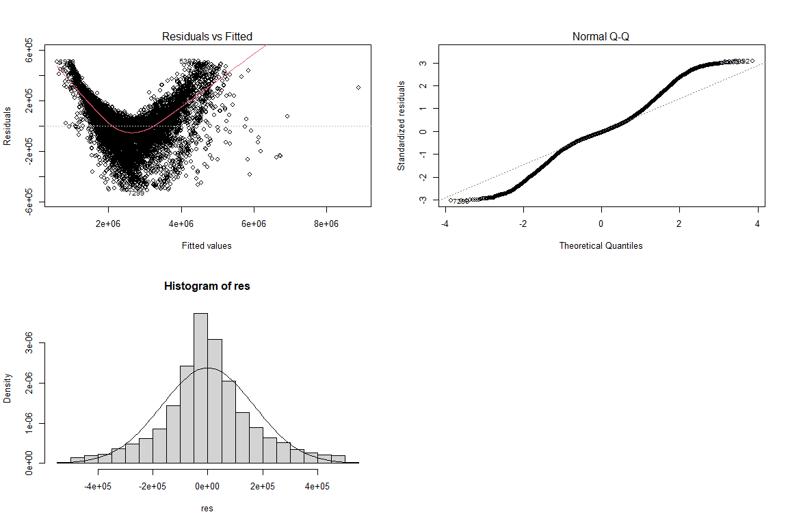

### 1.3.2 Modell 2 Stepwise:

    ## 
    ## Call:
    ## lm(formula = log(SåldPris) ~ Mäklare + Rum + ByggÅr + Kommun + 
    ##     AvståndVattenMeter + Våning + AreaPerRum + PrisPerKvm + HyraPerKvm, 
    ##     data = data_träning)
    ## 
    ## Residuals:
    ##      Min       1Q   Median       3Q      Max 
    ## -0.79562 -0.02026  0.00940  0.02968  0.11840 
    ## 
    ## Coefficients:
    ##                                                Estimate Std. Error  t value
    ## (Intercept)                                   1.200e+01  1.136e-02 1055.536
    ## MäklareERA                                   -3.827e-03  5.010e-03   -0.764
    ## MäklareErik Olsson Fastighetsförmedling       1.579e-03  4.578e-03    0.345
    ## MäklareFastighetsbyrån                       -5.955e-03  2.397e-03   -2.485
    ## MäklareHusmanHagberg                         -7.026e-03  2.836e-03   -2.477
    ## MäklareJägholm Norrortsmäklarna              -1.049e-02  3.980e-03   -2.635
    ## MäklareLänsförsäkringar Fastighetsförmedling  1.148e-04  2.286e-03    0.050
    ## MäklareMagnusson Mäkleri                     -2.690e-02  4.970e-03   -5.412
    ## MäklareMindre Mäklarfirmor                   -4.343e-03  2.979e-03   -1.458
    ## MäklareMOHV                                  -2.715e-03  3.512e-03   -0.773
    ## MäklareMäklarhuset                           -2.303e-03  3.375e-03   -0.682
    ## MäklareMäklarringen                          -1.857e-03  3.542e-03   -0.524
    ## MäklareNotar                                 -2.874e-03  3.071e-03   -0.936
    ## MäklareSkandiaMäklarna                       -8.505e-03  3.524e-03   -2.413
    ## MäklareSvensk Fastighetsförmedling           -4.243e-03  2.806e-03   -1.512
    ## MäklareSvenska Mäklarhuset                    2.777e-03  3.077e-03    0.902
    ## Rum1.5                                        4.516e-01  3.695e-03  122.229
    ## Rum2                                          7.371e-01  2.416e-03  305.095
    ## Rum2.5                                        9.565e-01  5.140e-03  186.078
    ## Rum3                                          1.129e+00  2.949e-03  382.933
    ## Rum3.5                                        1.261e+00  6.265e-03  201.283
    ## Rum4                                          1.403e+00  3.457e-03  405.718
    ## Rum5                                          1.629e+00  5.010e-03  325.129
    ## ByggÅr 1961 - 1970                           -1.373e-02  1.708e-03   -8.036
    ## ByggÅr 1971 - 1980                           -2.285e-02  2.304e-03   -9.917
    ## ByggÅr 1981 - 1990                           -1.598e-02  2.133e-03   -7.495
    ## ByggÅr 1991 - 2010                            6.783e-03  2.130e-03    3.184
    ## ByggÅr 2011 - 2022                            6.514e-03  1.904e-03    3.421
    ## ByggÅr Okänd                                 -3.338e-03  2.027e-03   -1.647
    ## KommunSollentuna                              2.021e-02  2.546e-03    7.937
    ## KommunTäby                                    2.898e-02  2.401e-03   12.068
    ## KommunUpplands Väsby                          1.910e-02  4.705e-03    4.059
    ## KommunVallentuna                              1.512e-02  4.903e-03    3.085
    ## KommunVaxholm                                 2.309e-02  3.711e-03    6.221
    ## KommunÖsteråker                               4.481e-03  3.189e-03    1.405
    ## AvståndVattenMeter                           -2.461e-06  4.629e-07   -5.316
    ## Våning 12 till 15                             1.155e-02  5.178e-03    2.230
    ## Våning 2 till 6                               3.893e-03  1.144e-03    3.403
    ## Våning 7 till 11                              5.510e-03  2.462e-03    2.238
    ## Våning Okänd                                 -4.564e-03  1.827e-03   -2.499
    ## AreaPerRum                                    3.551e-02  1.538e-04  230.854
    ## PrisPerKvm                                    2.295e-05  8.255e-08  277.990
    ## HyraPerKvm                                   -1.142e-03  6.028e-05  -18.941
    ##                                              Pr(>|t|)    
    ## (Intercept)                                   < 2e-16 ***
    ## MäklareERA                                   0.444989    
    ## MäklareErik Olsson Fastighetsförmedling      0.730236    
    ## MäklareFastighetsbyrån                       0.012990 *  
    ## MäklareHusmanHagberg                         0.013259 *  
    ## MäklareJägholm Norrortsmäklarna              0.008425 ** 
    ## MäklareLänsförsäkringar Fastighetsförmedling 0.959960    
    ## MäklareMagnusson Mäkleri                     6.37e-08 ***
    ## MäklareMindre Mäklarfirmor                   0.144878    
    ## MäklareMOHV                                  0.439418    
    ## MäklareMäklarhuset                           0.494984    
    ## MäklareMäklarringen                          0.600163    
    ## MäklareNotar                                 0.349352    
    ## MäklareSkandiaMäklarna                       0.015820 *  
    ## MäklareSvensk Fastighetsförmedling           0.130557    
    ## MäklareSvenska Mäklarhuset                   0.366828    
    ## Rum1.5                                        < 2e-16 ***
    ## Rum2                                          < 2e-16 ***
    ## Rum2.5                                        < 2e-16 ***
    ## Rum3                                          < 2e-16 ***
    ## Rum3.5                                        < 2e-16 ***
    ## Rum4                                          < 2e-16 ***
    ## Rum5                                          < 2e-16 ***
    ## ByggÅr 1961 - 1970                           1.04e-15 ***
    ## ByggÅr 1971 - 1980                            < 2e-16 ***
    ## ByggÅr 1981 - 1990                           7.21e-14 ***
    ## ByggÅr 1991 - 2010                           0.001458 ** 
    ## ByggÅr 2011 - 2022                           0.000626 ***
    ## ByggÅr Okänd                                 0.099635 .  
    ## KommunSollentuna                             2.30e-15 ***
    ## KommunTäby                                    < 2e-16 ***
    ## KommunUpplands Väsby                         4.97e-05 ***
    ## KommunVallentuna                             0.002042 ** 
    ## KommunVaxholm                                5.15e-10 ***
    ## KommunÖsteråker                              0.159996    
    ## AvståndVattenMeter                           1.08e-07 ***
    ## Våning 12 till 15                            0.025750 *  
    ## Våning 2 till 6                              0.000668 ***
    ## Våning 7 till 11                             0.025274 *  
    ## Våning Okänd                                 0.012483 *  
    ## AreaPerRum                                    < 2e-16 ***
    ## PrisPerKvm                                    < 2e-16 ***
    ## HyraPerKvm                                    < 2e-16 ***
    ## ---
    ## Signif. codes:  0 '***' 0.001 '**' 0.01 '*' 0.05 '.' 0.1 ' ' 1
    ## 
    ## Residual standard error: 0.04784 on 9311 degrees of freedom
    ## Multiple R-squared:  0.9755, Adjusted R-squared:  0.9754 
    ## F-statistic:  8817 on 42 and 9311 DF,  p-value: < 2.2e-16

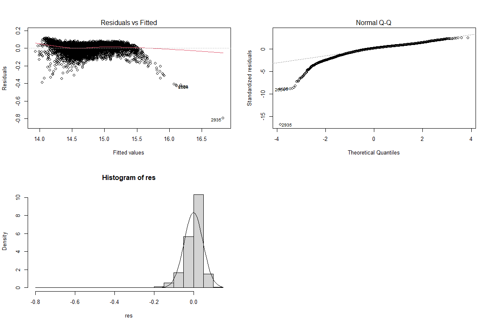

### 1.3.3 Modell 3 Stepwise:

    ## 
    ## Call:
    ## lm(formula = log(SåldPris) ~ Rum + ByggÅr + Kommun + Våning + 
    ##     log(AreaPerRum) + log(PrisPerKvm), data = data_träning)
    ## 
    ## Residuals:
    ##        Min         1Q     Median         3Q        Max 
    ## -3.965e-10 -6.622e-11 -3.800e-13  6.592e-11  3.594e-10 
    ## 
    ## Coefficients:
    ##                        Estimate Std. Error    t value Pr(>|t|)    
    ## (Intercept)           3.680e-12  9.023e-11  4.100e-02 0.967473    
    ## Rum1.5                4.055e-01  7.380e-12  5.494e+10  < 2e-16 ***
    ## Rum2                  6.931e-01  4.350e-12  1.593e+11  < 2e-16 ***
    ## Rum2.5                9.163e-01  1.010e-11  9.071e+10  < 2e-16 ***
    ## Rum3                  1.099e+00  5.133e-12  2.140e+11  < 2e-16 ***
    ## Rum3.5                1.253e+00  1.247e-11  1.005e+11  < 2e-16 ***
    ## Rum4                  1.386e+00  6.093e-12  2.275e+11  < 2e-16 ***
    ## Rum5                  1.609e+00  9.184e-12  1.752e+11  < 2e-16 ***
    ## ByggÅr 1961 - 1970    8.509e-12  3.507e-12  2.426e+00 0.015277 *  
    ## ByggÅr 1971 - 1980    8.005e-12  4.741e-12  1.689e+00 0.091341 .  
    ## ByggÅr 1981 - 1990   -3.685e-12  4.337e-12 -8.500e-01 0.395440    
    ## ByggÅr 1991 - 2010    7.975e-12  4.275e-12  1.866e+00 0.062136 .  
    ## ByggÅr 2011 - 2022    2.676e-12  3.847e-12  6.960e-01 0.486691    
    ## ByggÅr Okänd         -5.824e-14  4.118e-12 -1.400e-02 0.988717    
    ## KommunSollentuna     -1.811e-11  4.843e-12 -3.740e+00 0.000185 ***
    ## KommunTäby           -2.041e-11  4.447e-12 -4.589e+00 4.51e-06 ***
    ## KommunUpplands Väsby -1.367e-11  5.729e-12 -2.386e+00 0.017030 *  
    ## KommunVallentuna     -1.601e-11  6.253e-12 -2.560e+00 0.010483 *  
    ## KommunVaxholm        -2.835e-11  6.844e-12 -4.142e+00 3.47e-05 ***
    ## KommunÖsteråker      -1.763e-11  6.291e-12 -2.803e+00 0.005069 ** 
    ## Våning 12 till 15     1.586e-11  1.069e-11  1.484e+00 0.137871    
    ## Våning 2 till 6       6.928e-12  2.360e-12  2.936e+00 0.003336 ** 
    ## Våning 7 till 11      1.230e-11  5.070e-12  2.425e+00 0.015314 *  
    ## Våning Okänd          3.800e-12  3.699e-12  1.027e+00 0.304225    
    ## log(AreaPerRum)       1.000e+00  8.202e-12  1.219e+11  < 2e-16 ***
    ## log(PrisPerKvm)       1.000e+00  6.708e-12  1.491e+11  < 2e-16 ***
    ## ---
    ## Signif. codes:  0 '***' 0.001 '**' 0.01 '*' 0.05 '.' 0.1 ' ' 1
    ## 
    ## Residual standard error: 9.911e-11 on 9328 degrees of freedom
    ## Multiple R-squared:      1,  Adjusted R-squared:      1 
    ## F-statistic: 3.538e+21 on 25 and 9328 DF,  p-value: < 2.2e-16

### 1.3.4 Modell 4 Stepwise:

    ## 
    ## Call:
    ## lm(formula = log(SåldPris) ~ Rum + ByggÅr + Kommun + Våning + 
    ##     log(AreaPerRum) + log(PrisPerKvm), data = data_träning)
    ## 
    ## Residuals:
    ##        Min         1Q     Median         3Q        Max 
    ## -3.965e-10 -6.622e-11 -3.800e-13  6.592e-11  3.594e-10 
    ## 
    ## Coefficients:
    ##                        Estimate Std. Error    t value Pr(>|t|)    
    ## (Intercept)           3.680e-12  9.023e-11  4.100e-02 0.967473    
    ## Rum1.5                4.055e-01  7.380e-12  5.494e+10  < 2e-16 ***
    ## Rum2                  6.931e-01  4.350e-12  1.593e+11  < 2e-16 ***
    ## Rum2.5                9.163e-01  1.010e-11  9.071e+10  < 2e-16 ***
    ## Rum3                  1.099e+00  5.133e-12  2.140e+11  < 2e-16 ***
    ## Rum3.5                1.253e+00  1.247e-11  1.005e+11  < 2e-16 ***
    ## Rum4                  1.386e+00  6.093e-12  2.275e+11  < 2e-16 ***
    ## Rum5                  1.609e+00  9.184e-12  1.752e+11  < 2e-16 ***
    ## ByggÅr 1961 - 1970    8.509e-12  3.507e-12  2.426e+00 0.015277 *  
    ## ByggÅr 1971 - 1980    8.005e-12  4.741e-12  1.689e+00 0.091341 .  
    ## ByggÅr 1981 - 1990   -3.685e-12  4.337e-12 -8.500e-01 0.395440    
    ## ByggÅr 1991 - 2010    7.975e-12  4.275e-12  1.866e+00 0.062136 .  
    ## ByggÅr 2011 - 2022    2.676e-12  3.847e-12  6.960e-01 0.486691    
    ## ByggÅr Okänd         -5.824e-14  4.118e-12 -1.400e-02 0.988717    
    ## KommunSollentuna     -1.811e-11  4.843e-12 -3.740e+00 0.000185 ***
    ## KommunTäby           -2.041e-11  4.447e-12 -4.589e+00 4.51e-06 ***
    ## KommunUpplands Väsby -1.367e-11  5.729e-12 -2.386e+00 0.017030 *  
    ## KommunVallentuna     -1.601e-11  6.253e-12 -2.560e+00 0.010483 *  
    ## KommunVaxholm        -2.835e-11  6.844e-12 -4.142e+00 3.47e-05 ***
    ## KommunÖsteråker      -1.763e-11  6.291e-12 -2.803e+00 0.005069 ** 
    ## Våning 12 till 15     1.586e-11  1.069e-11  1.484e+00 0.137871    
    ## Våning 2 till 6       6.928e-12  2.360e-12  2.936e+00 0.003336 ** 
    ## Våning 7 till 11      1.230e-11  5.070e-12  2.425e+00 0.015314 *  
    ## Våning Okänd          3.800e-12  3.699e-12  1.027e+00 0.304225    
    ## log(AreaPerRum)       1.000e+00  8.202e-12  1.219e+11  < 2e-16 ***
    ## log(PrisPerKvm)       1.000e+00  6.708e-12  1.491e+11  < 2e-16 ***
    ## ---
    ## Signif. codes:  0 '***' 0.001 '**' 0.01 '*' 0.05 '.' 0.1 ' ' 1
    ## 
    ## Residual standard error: 9.911e-11 on 9328 degrees of freedom
    ## Multiple R-squared:      1,  Adjusted R-squared:      1 
    ## F-statistic: 3.538e+21 on 25 and 9328 DF,  p-value: < 2.2e-16

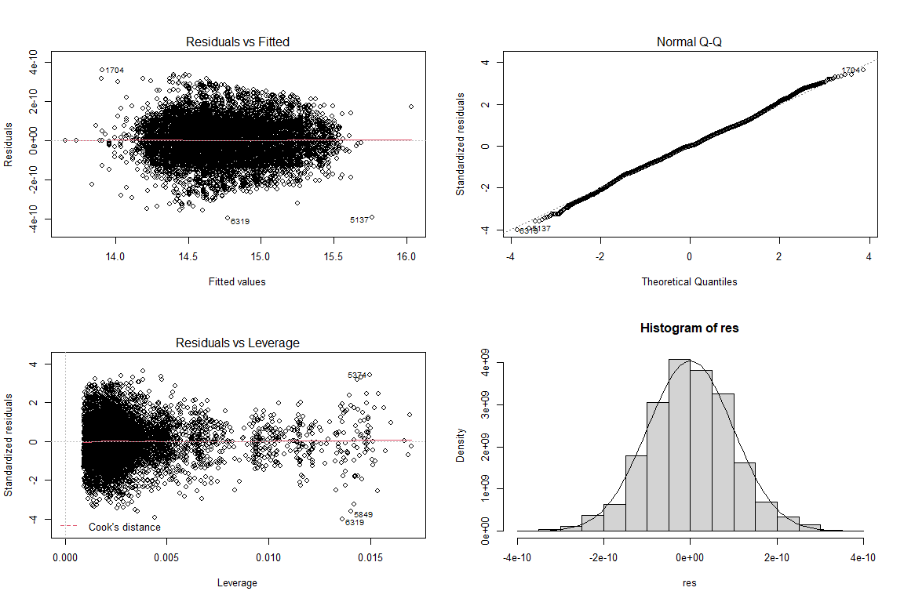

### 1.3.5 Modell 5 Stepwise:

    ## 
    ## Call:
    ## lm(formula = log(SåldPris) ~ Rum + ByggÅr + Kommun + Våning + 
    ##     log(AreaPerRum) + log(PrisPerKvm), data = data_träning)
    ## 
    ## Residuals:
    ##        Min         1Q     Median         3Q        Max 
    ## -3.965e-10 -6.622e-11 -3.800e-13  6.592e-11  3.594e-10 
    ## 
    ## Coefficients:
    ##                        Estimate Std. Error    t value Pr(>|t|)    
    ## (Intercept)           3.680e-12  9.023e-11  4.100e-02 0.967473    
    ## Rum1.5                4.055e-01  7.380e-12  5.494e+10  < 2e-16 ***
    ## Rum2                  6.931e-01  4.350e-12  1.593e+11  < 2e-16 ***
    ## Rum2.5                9.163e-01  1.010e-11  9.071e+10  < 2e-16 ***
    ## Rum3                  1.099e+00  5.133e-12  2.140e+11  < 2e-16 ***
    ## Rum3.5                1.253e+00  1.247e-11  1.005e+11  < 2e-16 ***
    ## Rum4                  1.386e+00  6.093e-12  2.275e+11  < 2e-16 ***
    ## Rum5                  1.609e+00  9.184e-12  1.752e+11  < 2e-16 ***
    ## ByggÅr 1961 - 1970    8.509e-12  3.507e-12  2.426e+00 0.015277 *  
    ## ByggÅr 1971 - 1980    8.005e-12  4.741e-12  1.689e+00 0.091341 .  
    ## ByggÅr 1981 - 1990   -3.685e-12  4.337e-12 -8.500e-01 0.395440    
    ## ByggÅr 1991 - 2010    7.975e-12  4.275e-12  1.866e+00 0.062136 .  
    ## ByggÅr 2011 - 2022    2.676e-12  3.847e-12  6.960e-01 0.486691    
    ## ByggÅr Okänd         -5.824e-14  4.118e-12 -1.400e-02 0.988717    
    ## KommunSollentuna     -1.811e-11  4.843e-12 -3.740e+00 0.000185 ***
    ## KommunTäby           -2.041e-11  4.447e-12 -4.589e+00 4.51e-06 ***
    ## KommunUpplands Väsby -1.367e-11  5.729e-12 -2.386e+00 0.017030 *  
    ## KommunVallentuna     -1.601e-11  6.253e-12 -2.560e+00 0.010483 *  
    ## KommunVaxholm        -2.835e-11  6.844e-12 -4.142e+00 3.47e-05 ***
    ## KommunÖsteråker      -1.763e-11  6.291e-12 -2.803e+00 0.005069 ** 
    ## Våning 12 till 15     1.586e-11  1.069e-11  1.484e+00 0.137871    
    ## Våning 2 till 6       6.928e-12  2.360e-12  2.936e+00 0.003336 ** 
    ## Våning 7 till 11      1.230e-11  5.070e-12  2.425e+00 0.015314 *  
    ## Våning Okänd          3.800e-12  3.699e-12  1.027e+00 0.304225    
    ## log(AreaPerRum)       1.000e+00  8.202e-12  1.219e+11  < 2e-16 ***
    ## log(PrisPerKvm)       1.000e+00  6.708e-12  1.491e+11  < 2e-16 ***
    ## ---
    ## Signif. codes:  0 '***' 0.001 '**' 0.01 '*' 0.05 '.' 0.1 ' ' 1
    ## 
    ## Residual standard error: 9.911e-11 on 9328 degrees of freedom
    ## Multiple R-squared:      1,  Adjusted R-squared:      1 
    ## F-statistic: 3.538e+21 on 25 and 9328 DF,  p-value: < 2.2e-16

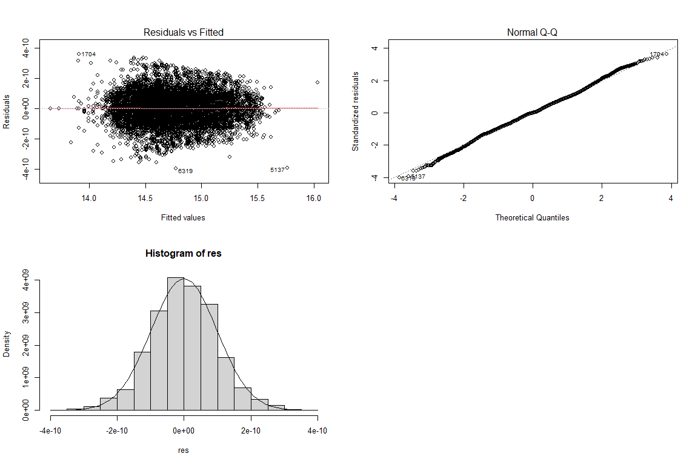

1.4 Prediktion:
---------------

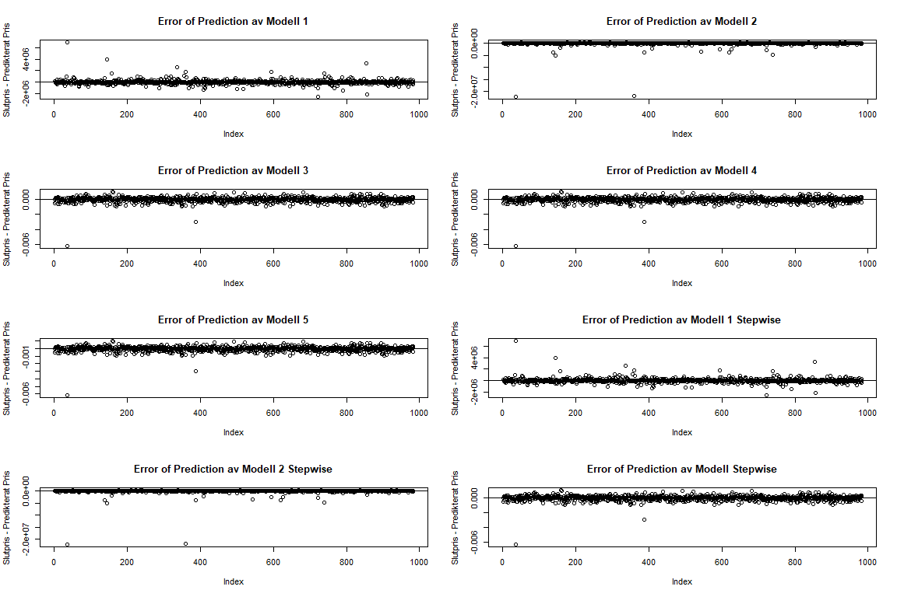
